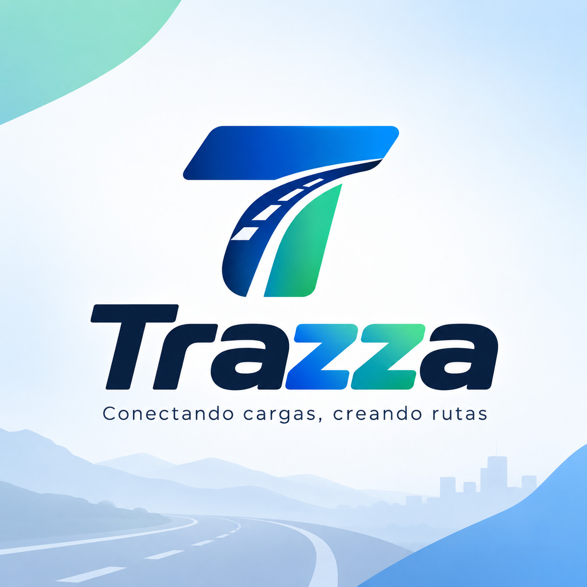
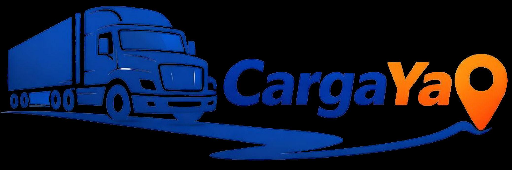

# Capítulo II: Requirements Elicitation & Analysis

## 2.1. Competidores

### 2.1.1. Análisis competitivo
<table style="width:100%; border-collapse:collapse; table-layout:fixed;" border="1" align="center">
  <!-- Título principal -->
  <tr>
    <th colspan="6" align="center">Competitive Analysis Landscape</th>
  </tr>
  <!-- Justificación -->
  <tr>
    <td rowspan="2" align="center"><b>¿Por qué llevar a cabo este análisis?</b></td>
    <td colspan="5" align="center">
      Identificar cómo se posicionan los principales competidores del sector de intermediación de carga terrestre en Perú y la región, para detectar vacíos de mercado y oportunidades de diferenciación para Trazza
    </td>
  </tr>
  <tr>
    <td colspan="5">
      <b>Objetivo:</b> Delimitar oportunidades de mercado no cubiertas por la competencia actual y anticipar posibles amenazas de entrada de actores regionales consolidados.   
    </td>
  </tr>
  <!-- Encabezados con logos -->
  <tr>
    <th colspan="2" style="width:20%">Competidor</th>
    <th style="width:20%">
       
      Trazza (Propuesta)
    </th>
    <th style="width:20%">
       
      CargaYa
    </th>
    <th style="width:20%">
       
      MiCarga
    </th>   
    <th style="width:20%">
       
      FleteRetorno
    </th>
  </tr>
  <!-- PERFIL -->
  <tr>
    <td rowspan="2" align="center"><b>Perfil</b></td>
    <td><b>Overview</b></td>
    <td>Startup peruana que conecta, mediante un motor de emparejamiento con IA, la capacidad ociosa de transportistas con la necesidad de envíos ágiles de pymes en Lima.</td>
    <td>Plataforma peruana que conecta empresarios que publican carga con transportistas verificados por ruta a nivel nacional.</td>
    <td>Aplicativo peruano pionero (desarrollado por Tracklink) que conecta usuarios con transportistas disponibles para mudanzas y envío de carga de todo tipo.</td>
    <td>Aplicación chilena de "economía circular" enfocada exclusivamente en revender los tramos de retorno vacíos ya contratados por transportistas pyme.</td>
  </tr>
  <tr>
    <td><b>Ventaja competitiva: ¿Qué valor ofrece a los clientes?</b></td>
    <td>Emparejamiento automatizado por IA que reduce el esfuerzo de búsqueda, combinado con optimización de rutas y trazabilidad IoT/GPS sin cobrar comisión por la transacción en sí.    Mitiga hasta un 30% de pérdidas operativas al transportista y reduce costos/tiempos de espera al emprendedor, con tranquilidad operativa vía monitoreo continuo.</td>
    <td>Validación de identidad (DNI/RUC vía RENIEC y SUNAT) y negociación directa sin intermediarios, con 0% de comisión para transportistas.    Encontrar transportistas disponibles por ruta en minutos y negociar la tarifa directamente, sin comisión para quien transporta.</td>
    <td>Monitoreo GPS en tiempo real durante todo el traslado y calificación de transportistas verificados.    Publicar una carga y recibir cotizaciones de transportistas calificados, pagando dentro de la misma plataforma.</td>
    <td>Modelo pionero y especializado exclusivamente en tramos de retorno, con enfoque de sostenibilidad (reducción de huella de carbono) como parte de su propuesta de valor.    Acceder a fletes más económicos aprovechando camiones que de todas formas regresarán vacíos, con menor huella de carbono.</td>
  </tr>
  <!-- PERFIL DE MARKETING -->
  <tr>
    <td rowspan="2" align="center"><b>Perfil de Marketing</b></td>
    <td><b>Mercado objetivo</b></td>
    <td>Transportistas independientes/pequeñas flotas y pymes emprendedoras del departamento de Lima.</td>
    <td>Transportistas y empresarios generadores de carga en rutas interprovinciales del Perú (Lima–Arequipa, Lima–Trujillo, entre otras).</td>
    <td>Personas y empresas que requieren mudanzas o traslado de carga ligera, mediana o pesada a nivel nacional.</td>
    <td>Transportistas pyme y empresas generadoras de carga a lo largo de todo Chile (Arica–Puerto Montt), con expansión regional en curso.</td>
  </tr>
  <tr>
    <td><b>Estrategias de marketing</b></td>
    <td>Alianzas con gremios de transportistas y marketing digital dirigido a emprendedores pyme, apalancado en el efecto recomendación.</td>
    <td>Marketing digital orientado a rutas específicas y testimonios de usuarios ("no tengo que regresar vacío").</td>
    <td>Presencia en tiendas de aplicaciones (Google Play) y relaciones públicas como "primer aplicativo de carga del Perú".</td>
    <td>Comunicación centrada en el impacto ambiental (triple impacto) y alianzas con aceleradoras de negocio (UDD Ventures, Corfo).</td>
  </tr>
  <!-- PERFIL DE PRODUCTO -->
  <tr>
    <td rowspan="3" align="center"><b>Perfil de Producto</b></td>
    <td><b>Productos & Servicios</b></td>
    <td>Motor de emparejamiento con IA, algoritmos de optimización de ruteo, monitoreo IoT/GPS y canal de contacto in-app para negociación externa.</td>
    <td>Publicación de cargas, búsqueda de transportistas por ruta, chat de negociación, noticias sobre el estado de las vías.</td>
    <td>Publicación de carga, sistema de cotizaciones de transportistas, monitoreo GPS y calificación de conductores.</td>
    <td>Matching de tramos de retorno ya contratados con nuevos clientes que comparten origen–destino.</td>
  </tr>
  <tr>
    <td><b>Precios & Costos</b></td>
    <td>Sin comisión por transacción; el pago del servicio se coordina fuera de la plataforma.</td>
    <td>Transportistas: 0% de comisión. Empresarios: 3% en la primera carga, luego 5%.</td>
    <td>Comisión no publicada; el pago se realiza dentro de la plataforma.</td>
    <td>Tarifas "a precio de retorno", inferiores a un flete de ida, sin comisión detallada públicamente.</td>
  </tr>
  <tr>
    <td><b>Canales de distribución (Web y/o Móvil)</b></td>
    <td>Web Application (Angular) responsive; landing page estático.</td>
    <td>Plataforma web (cargaya.pe).</td>
    <td>App móvil (Android) y sitio web (micargapp.pe).</td>
    <td>Aplicación móvil y sitio web (fleteretorno.cl).</td>
  </tr>
  <!-- SWOT -->
  <tr>
    <td rowspan="4" align="center"><b>Análisis SWOT</b></td>
    <td><b>Fortalezas</b></td>
    <td>Enfoque doble en IA de emparejamiento y trazabilidad IoT, sin intermediar pagos (menor fricción regulatoria).</td>
    <td>Validación de identidad con fuentes oficiales (RENIEC/SUNAT), lo que genera confianza en una comunidad de transportistas informales.</td>
    <td>Primer movimiento en el mercado peruano y reconocimiento de marca previo.</td>
    <td>Modelo de negocio validado y respaldado por una aceleradora, con más de 1000 clientes inscritos.</td>
  </tr>
  <tr>
    <td><b>Debilidades</b></td>
    <td>Marca nueva sin reconocimiento en el mercado limeño; aún no cuenta con historial de "matches" exitosos.</td>
    <td>Cobra comisión creciente a los emprendedores conforme aumenta el uso.</td>
    <td>Poca diferenciación tecnológica frente a nuevos entrantes con IA.</td>
    <td>Actualmente enfocada en el mercado chileno; su expansión a Perú no está consolidada.</td>
  </tr>
  <tr>
    <td><b>Oportunidades</b></td>
    <td>Alta fragmentación del sector (más del 80% son micro y pequeñas flotas) sin una solución tecnológica unificada dominante en Lima.</td>
    <td>Ampliar su base de transportistas verificados a más rutas y ciudades.</td>
    <td>Incorporar inteligencia artificial a su motor de cotizaciones.</td>
    <td>Expandir su modelo especializado en retorno hacia el mercado peruano, replicando su éxito en Chile.</td>
  </tr>
  <tr>
    <td><b>Amenazas</b></td>
    <td>Entrada de actores regionales ya consolidados (Fretebras, FleteRetorno) al mercado peruano.</td>
    <td>Presión de plataformas con IA de emparejamiento más eficiente.</td>
    <td>Pérdida de cuota de mercado frente a plataformas con mejor experiencia de usuario.</td>
    <td>Competencia de actores locales con mejor conocimiento del contexto regulatorio peruano.</td>
  </tr>
</table>

### 2.1.2. Estrategias y tácticas frente a competidores
A partir del análisis competitivo, Trazza plantea las siguientes estrategias y tácticas preliminares para afrontar el panorama identificado:

- **Frente a la fragmentación del mercado (oportunidad):** Agilizar la incorporación inicial ofreciendo una alta simplicidad en la publicación de fletes y disponibilidad. Esto facilitará que la masa de transportistas independientes, que hoy gestionan sus viajes manualmente, se sumen a la plataforma sin trabas operativas.

- **Frente a la validación de confianza de CargaYa (fortaleza del competidor):** Implementar reputación entre pares y validación cruzada desde la primera versión del producto. La integración de rastreo satelital servirá como garantía de respaldo sobre el trayecto de los envíos mientras se desarrollan integraciones de validación oficial.

- **Frente al modelo de comisiones crecientes (debilidad detectada en CargaYa):** Posicionarse como un canal directo de conexión sin peajes financieros ni intermediación en los cobros. Esta política libera de sobrecostos a los comerciantes que buscan alternativas más eficientes que los esquemas tradicionales.

- **Frente al reconocimiento de marca de MiCarga (primer movimiento):** Destacar el uso de algoritmos avanzados de asignación y rutas inteligentes como ventaja técnica clave. Se recalcará el ahorro operativo tangible que esta automatización genera en comparación con tableros estáticos de anuncios.

- **Frente a la amenaza de expansión regional (FleteRetorno, Fretebras):** Ejecutar con agilidad las pruebas con usuarios clave en el mercado local para asegurar la tracción inicial. Fortalecer la presencia en el sector mediante acuerdos estratégicos con asociaciones de transportistas antes del ingreso de competidores internacionales.

## 2.2. Entrevistas

### 2.2.1. Diseño de entrevistas
Las preguntas se estructuraron bajo la metodología de entrevistas semiestructuradas: inician con interrogantes abiertas y neutrales para explorar hábitos vigentes, puntos de dolor y apertura a herramientas digitales, acompañadas de consultas orientadas a levantar el perfil demográfico y de comportamiento (edad, ubicación, rol profesional, adopción tecnológica y canales de uso habitual) para la elaboración de los arquetipos.

**Primer segmento: Transportistas de Carga Terrestre**

A continuación, se presentan las preguntas dirigidas a conductores independientes y dueños de pequeñas o medianas flotas que actualmente enfrentan la pérdida de rentabilidad asociada a los fletes de retorno vacíos.

**Preguntas principales**

1. ¿Con qué frecuencia regresas de un viaje con el camión vacío?
2. ¿Qué tan preocupante es para ti la pérdida económica que representa un flete de retorno vacío?
3. ¿Qué haces actualmente para conseguir carga para tu viaje de regreso?
4. ¿Cómo consigues normalmente tus contactos (clientes, vendedores, compradores) hoy en día?
5. ¿Confiarías en un sistema que te sugiera automáticamente qué carga tomar en tu ruta de retorno?
6. ¿Qué tan importante es para ti poder negociar el pago directamente con el cliente, fuera de una aplicación?
7. ¿Qué tan útil sería contar con un sistema que muestre la ubicación y el estado de la carga durante el trayecto?
8. ¿Qué te generaría más confianza para aceptar una carga ofrecida por una aplicación: la calificación del cliente, el monitoreo en tiempo real, o ambos?
9. ¿Qué tan dispuesto estarías a esperar unos minutos a que la aplicación te consiga una carga antes de salir con el camión vacío?
10. ¿Qué es lo que más te frustra del proceso actual de conseguir fletes de retorno?
11. ¿Usarías una aplicación móvil para publicar tu disponibilidad y recibir sugerencias de carga?
12. ¿Recomendarías una herramienta así a otros transportistas o dueños de flota que conozcas?

**Preguntas complementarias**

13. ¿Qué edad tienes?
14. ¿En qué distrito de Lima vives o tienes tu base de operaciones?
15. ¿Eres transportista independiente o dueño de una flota? ¿De cuántos vehículos?
16. ¿Qué tipo de vehículo(s) manejas o administras?
17. ¿Qué tan seguido usas aplicaciones móviles en tu día a día (WhatsApp, Maps, redes sociales)?
18. ¿Prefieres usar el celular o la computadora para gestionar tu trabajo?

**Segundo segmento: Pequeños y Medianos Emprendedores**

A continuación, se presentan las preguntas dirigidas a dueños de negocios pyme (comerciales, manufactureros o agrícolas) que requieren trasladar mercadería de forma frecuente sin contar con contratos fijos con grandes empresas logísticas.

**Preguntas principales**

1. ¿Con qué frecuencia necesitas enviar mercadería o insumos dentro de Lima?
2. ¿Qué tan preocupante es actualmente para ti el costo del transporte de tu mercadería?
3. ¿Cómo consigues transporte para tus envíos en la actualidad?
4. ¿Cuánto tiempo te toma normalmente encontrar un transportista disponible?
5. ¿Qué tan útil sería para tu negocio encontrar transportistas con espacio disponible a un menor costo?
6. ¿Qué tan importante es para ti poder ver en tiempo real dónde está tu mercadería?
7. ¿Confiarías en una aplicación que te emparejara automáticamente con un transportista disponible?
8. ¿Qué tan dispuesto estarías a coordinar y pagar el servicio directamente con el transportista, fuera de la aplicación?
9. ¿Qué es lo más importante para ti al elegir un transportista: precio, rapidez, seguridad de la carga, u otro?
10. ¿Qué te generaría más confianza para usar un transportista sugerido por una aplicación en lugar de uno de tu confianza habitual?
11. ¿Usarías una aplicación móvil o web para publicar tu necesidad de envío y recibir ofertas de transporte?
12. ¿Recomendarías esta herramienta a otros emprendedores o negocios similares al tuyo?

**Preguntas complementarias**

13. ¿Qué edad tienes?
14. ¿En qué distrito se ubica tu negocio?
15. ¿A qué rubro se dedica tu negocio? (comercial, manufactura, agrícola, otro)
16. ¿Cuántos envíos realizas en promedio al mes?
17. ¿Qué tan seguido gestionas tu negocio a través de canales digitales (redes sociales, e-commerce, pasarelas de pago)?
18. ¿Prefieres usar el celular o la computadora para gestionar tus pedidos y envíos?

**Segmento 1: Transportistas de Carga Terrestre**

| # | Nombres y Apellidos | Edad | Distrito | Screenshot | URL del video (Microsoft Stream) | Inicio | Duración |
| :--- | :--- | :--- | :--- | :--- | :--- | :--- | :--- |
| 1 | [Nombre Apellido] | [Edad] | [Distrito] | *(captura del video)* | [URL privado] | [hh:mm:ss] | [mm:ss] |
| 2 | [Nombre Apellido] | [Edad] | [Distrito] | *(captura del video)* | [URL privado] | [hh:mm:ss] | [mm:ss] |
| 3 | [Nombre Apellido] | [Edad] | [Distrito] | *(captura del video)* | [URL privado] | [hh:mm:ss] | [mm:ss] |

*Resumen de entrevista 1:* 

*Resumen de entrevista 2:*

*Resumen de entrevista 3:*

**Segmento 2: Pequeños y Medianos Emprendedores**

| # | Nombres y Apellidos | Edad | Distrito | Screenshot | URL del video (Microsoft Stream) | Inicio | Duración |
| :--- | :--- | :--- | :--- | :--- | :--- | :--- | :--- |
| 1 | [Nombre Apellido] | [Edad] | [Distrito] | *(captura del video)* | [URL privado] | [hh:mm:ss] | [mm:ss] |
| 2 | [Nombre Apellido] | [Edad] | [Distrito] | *(captura del video)* | [URL privado] | [hh:mm:ss] | [mm:ss] |
| 3 | [Nombre Apellido] | [Edad] | [Distrito] | *(captura del video)* | [URL privado] | [hh:mm:ss] | [mm:ss] |

*Resumen de entrevista 1:* 

*Resumen de entrevista 2:* 

*Resumen de entrevista 3:*

### 2.2.2. Registro de entrevistas

### 2.2.3. Análisis de entrevistas

## 2.3. Needfinding

### 2.3.1. User Personas

### 2.3.2. User Task Matrix

### 2.3.3. User Journey Mapping

### 2.3.4. Empathy Mapping

## 2.4. Big Picture Event Storming

## 2.5. Ubiquitous Language