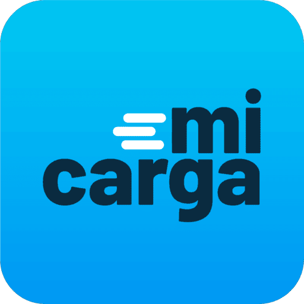
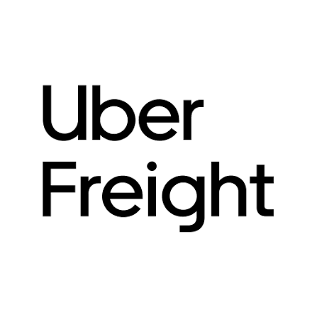

# Capítulo II: Requirements Elicitation & Analysis

## 2.1. Competidores.

### 2.1.1. Análisis competitivo

| &nbsp;                                    | **Competitive Analysis Landscape**                                                                                                                                                                                                                                                                                                                                                                                                                    |
| ----------------------------------------- | ----------------------------------------------------------------------------------------------------------------------------------------------------------------------------------------------------------------------------------------------------------------------------------------------------------------------------------------------------------------------------------------------------------------------------------------------------- |
| **¿Por qué llevar a cabo este análisis?** | Comprender cómo se posiciona Trazza frente a las plataformas de intermediación de carga locales e internacionales (CargaYa, MiCarga y Uber Freight), con el fin de identificar oportunidades de diferenciación tecnológica (motor de emparejamiento con IA, algoritmos de optimización de rutas y trazabilidad IoT/GPS) y definir estrategias competitivas de adquisición y modelo de negocio adaptadas al mercado de transportistas y pymes en Lima. |

| &nbsp;                  | &nbsp;                                                       | **Trazza**                                                                                                                                                                                                                                 | **CargaYa**                                                                                                                                                              | **MiCarga**                                                                                                                                                         | **Uber Freight**                                                                                                                                                                |
| ----------------------- | ------------------------------------------------------------ | ------------------------------------------------------------------------------------------------------------------------------------------------------------------------------------------------------------------------------------------ | ------------------------------------------------------------------------------------------------------------------------------------------------------------------------ | ------------------------------------------------------------------------------------------------------------------------------------------------------------------- | ------------------------------------------------------------------------------------------------------------------------------------------------------------------------------- |
| **Logo**                | &nbsp;                                                       |                                                                                                                                                                                   |                                                                                                              |                                                                                                          |                                                                                                            |
| **Perfil**              | **Overview**                                                 | Startup peruana que conecta, mediante un motor de emparejamiento inteligente con IA y optimización de rutas, la capacidad ociosa de transportistas (retornos vacíos) con la demanda de envíos ágiles de pymes en Lima.                     | Plataforma digital peruana que conecta a generadores de carga con transportistas verificados por ruta a nivel nacional, facilitando la publicación y búsqueda de fletes. | Aplicativo móvil peruano (desarrollado por Tracklink) que conecta usuarios y empresas con transportistas disponibles para mudanzas y traslados de carga en general. | Plataforma logística global de Uber que utiliza tecnología avanzada y algoritmos para conectar digitalmente a transportistas y flotas con empresas generadoras de carga pesada. |
| &nbsp;                  | **Ventaja competitiva ¿Qué valor ofrece a los clientes?** | Emparejamiento automatizado con IA sin intermediar transacciones financieras (0% comisiones). Mitiga hasta un 30% de pérdidas en viajes de retorno a transportistas y brinda envíos rápidos y trazabilidad en tiempo real a emprendedores. | Validación de identidad con fuentes oficiales (RENIEC/SUNAT) y negociación directa de tarifas entre las partes sin cobro de comisión al transportista.                   | Monitoreo GPS en tiempo real durante todo el traslado, calificación de transportistas verificados y cotización rápida desde la app.                                 | Cotización instantánea y garantizada (Upfront Pricing), reserva automatizada de cargas 24/7 y seguimiento digital integral respaldado por infraestructura tecnológica global.   |
| **Perfil de Marketing** | **Mercado objetivo**                                         | Transportistas independientes, pequeñas flotas y emprendedores/dueños de negocios pyme del departamento de Lima.                                                                                                                           | Transportistas y empresarios generadores de carga en las principales rutas interprovinciales del Perú.                                                                   | Personas particulares y microempresas que requieren mudanzas o traslado de carga ligera, mediana o pesada a nivel nacional.                                         | Empresas medianas y corporativas generadoras de carga (shippers), así como transportistas independientes y flotas a escala internacional.                                       |
| &nbsp;                  | **Estrategias de marketing**                                 | Alianzas con gremios de transportistas, marketing digital para pymes y crecimiento orgánico basado en recomendación boca a boca.                                                                                                           | Marketing digital enfocado en rutas específicas, presencia en redes sociales y testimonios de transportistas de retorno.                                                 | Presencia en tiendas de aplicaciones (Google Play/App Store) y posicionamiento como "el primer aplicativo de carga del Perú".                                       | Marketing corporativo B2B, posicionamiento global de la marca Uber, alianzas enterprise y demostraciones de eficiencia tecnológica.                                             |
| **Perfil de Producto**  | **Productos & Servicios**                                    | Motor de emparejamiento con IA, algoritmos de optimización de ruteo (Dijkstra, TSP), monitoreo IoT/GPS y canal de contacto directo para negociación externa.                                                                               | Publicación y búsqueda de cargas por ruta, chat de negociación directa y módulo informativo sobre el estado de carreteras.                                               | Publicación de solicitudes de traslado, sistema de cotizaciones de transportistas, monitoreo GPS y calificación de servicio.                                        | Aplicación móvil y portal web para reserva de cargas, fijación algorítmica de precios, rastreo de envíos en tiempo real y analítica logística.                                  |
| &nbsp;                  | **Precios & Costos**                                         | Sin comisión por transacción; el acuerdo económico se realiza externamente entre las partes sin costo en la plataforma.                                                                                                                    | Transportistas: 0% de comisión. Generadores de carga: 3% en la primera operación y 5% a partir de la segunda.                                                         | Comisión integrada no pública; la gestión del pago se procesa dentro del aplicativo.                                                                                | Margen variable integrado dinámicamente en la tarifa por flete según oferta, demanda y distancia de la ruta.                                                                    |
| &nbsp;                  | **Canales de distribución (Web y/o Móvil)**                  | Aplicación Web Responsive (Angular) y Landing Page informativo.                                                                                                                                                                            | Plataforma web (cargaya.pe).                                                                                                                                             | Aplicación móvil (Android/iOS) y portal web (micargapp.pe).                                                                                                         | Aplicación móvil (Android/iOS) para conductores y plataforma web empresarial para generadores de carga.                                                                         |
| **Análisis SWOT**       | **Fortalezas**                                               | Enfoque innovador con IA para aprovechamiento de retornos vacíos, sin cobro de comisiones y con trazabilidad IoT/GPS integrada.                                                                                                            | Verificación de antecedentes con RENIEC y SUNAT, brindando confianza y seguridad a los usuarios.                                                                         | Pionero en el mercado peruano, respaldo corporativo de Tracklink y base instalada de usuarios.                                                                      | Liderazgo tecnológico mundial, capacidad financiera masiva, algoritmos maduros y alta confiabilidad de marca.                                                                   |
| &nbsp;                  | **Debilidades**                                              | Marca emergente en etapa inicial sin reconocimiento previo en el mercado local; necesidad de construir base de usuarios.                                                                                                                   | Modelo de comisión creciente para los generadores de carga que puede desincentivar el uso recurrente.                                                                    | Menor nivel de automatización e inteligencia artificial en la asignación y optimización de rutas.                                                                   | Costos operativos elevados y plataforma no diseñada para la informalidad ni dinámicas de negociación directa en mercados emergentes.                                            |
| &nbsp;                  | **Oportunidades**                                            | Gran volumen de transporte informal desatendido en Lima (más del 80% son micro/pequeñas flotas) sin herramientas digitales accesibles.                                                                                                     | Extender la verificación y presencia a más regiones y puertos del territorio nacional.                                                                                   | Integrar algoritmos avanzados de IA para optimizar cotizaciones y tiempos de asignación.                                                                            | Expansión potencial de sus operaciones hacia el mercado de transporte de carga en Sudamérica.                                                                                   |
| &nbsp;                  | **Amenazas**                                                 | Reticencia inicial al cambio tecnológico por parte de transportistas tradicionales e informales.                                                                                                                                           | Entrada de plataformas tecnológicas con asignación automatizada por IA sin comisiones.                                                                                   | Pérdida de preferencia de usuarios frente a herramientas con mejor experiencia y menores costos.                                                                    | Dificultad para adaptarse a regulaciones locales, alta informalidad y riesgos de seguridad en Latinoamérica.                                                                    |

 

### 2.1.2. Estrategias y tácticas frente a competidores.

A partir del análisis competitivo realizado, Trazza plantea las siguientes estrategias y tácticas para posicionarse sólidamente en el mercado:

* **Frente a la fragmentación y falta de digitalización (Oportunidad del mercado local):** Desarrollar un proceso de registro y publicación ultraligero que permita a los transportistas independientes y pequeñas flotas registrar su disponibilidad de retorno en segundos desde cualquier dispositivo, capturando la alta demanda desatendida que hoy opera de manera informal.

* **Frente a la validación de identidad de CargaYa (Fortaleza del competidor):** Aunque Trazza no intermedia pagos en su MVP, implementará un sistema transparente de calificaciones y reputación comunitaria entre transportistas y pymes, respaldado por la trazabilidad IoT/GPS en tiempo real como garantía objetiva de seguridad durante el trayecto.

* **Frente al cobro de comisiones por transacción de CargaYa y MiCarga (Debilidad detectada):** Promover activamente como propuesta de valor que Trazza actúa como facilitador tecnológico con 0% de comisiones por flete, permitiendo que las partes negocien directamente sin sobrecostos que encarezcan el flete.

* **Frente al posicionamiento temprano de MiCarga (Fortaleza del competidor):** Diferenciarse mediante la incorporación de tecnología avanzada: el motor de emparejamiento con IA y los algoritmos de optimización de ruteo (Dijkstra, TSP), comunicando claramente el impacto económico cuantificable (recuperación de hasta un 30% de rentabilidad operativa en retornos).

* **Frente a gigantes tecnológicos internacionales como Uber Freight (Referente global):** Aprovechar la agilidad de una solución nativa enfocada en la realidad operativa y económica de Lima. Mientras que plataformas como Uber Freight imponen tarifas algorítmicas rígidas y esquemas corporativos complejos, Trazza ofrece flexibilidad, contacto directo y cero comisiones, adaptándose a las necesidades reales de los transportistas independientes y pymes locales.
