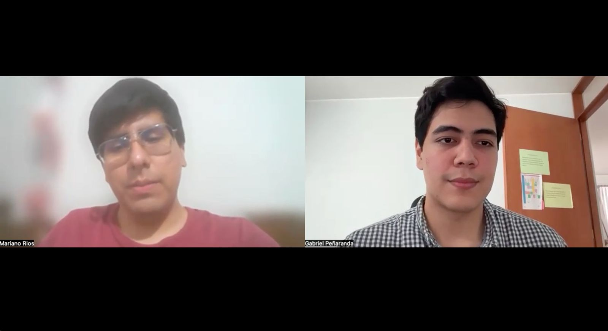
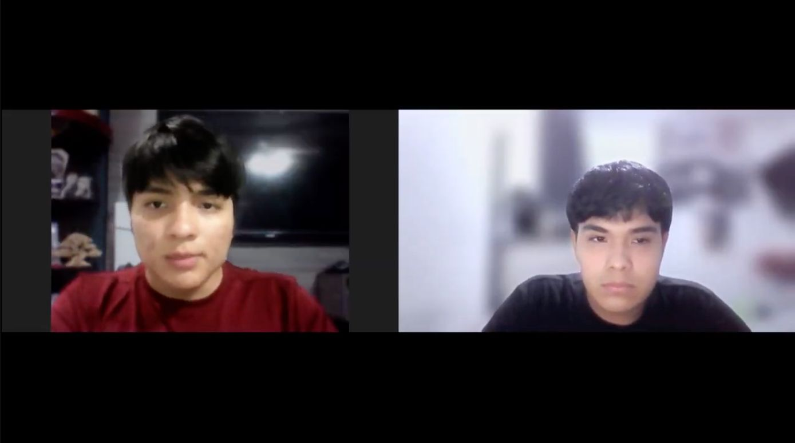
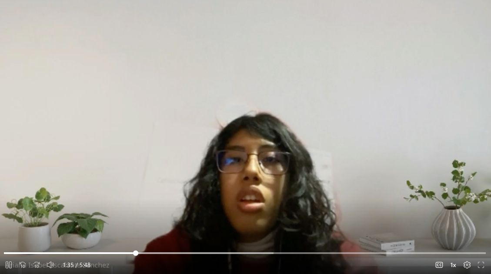
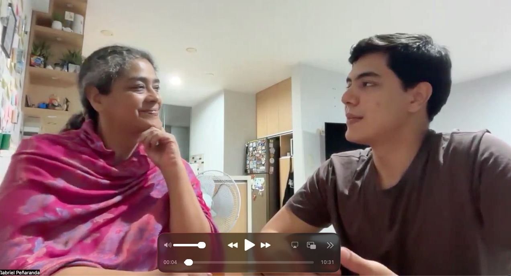

## 2.2. Entrevistas.
### 2.2.1. Diseño de entrevistas

Las preguntas fueron diseñadas siguiendo buenas prácticas de entrevistas semiestructuradas: se parte de preguntas principales, abiertas y no sesgadas, orientadas a comprender comportamientos actuales, frustraciones y disposición a adoptar una solución tecnológica; y se complementan con preguntas que permiten recolectar la información demográfica y conductual necesaria para construir los arquetipos (edad, distrito, ocupación, nivel de digitalización, dispositivos y canales digitales de preferencia).

**Primer segmento: Transportistas de Carga Terrestre**

A continuación, se presentan las preguntas dirigidas a conductores independientes y dueños de pequeñas o medianas flotas que actualmente enfrentan la pérdida de rentabilidad asociada a los fletes de retorno vacíos.

**Preguntas principales**

1. ¿Con qué frecuencia regresas de un viaje con el camión vacío?
2. ¿Qué tan preocupante es para ti la pérdida económica que representa un flete de retorno vacío?
3. ¿Qué haces actualmente para conseguir carga para tu viaje de regreso?
4. ¿Cómo consigues normalmente tus contactos (clientes, vendedores, compradores) hoy en día?
5. ¿Confiarías en un sistema que te sugiera automáticamente qué carga tomar en tu ruta de retorno?
6. ¿Qué tan importante es para ti poder negociar el pago directamente con el cliente, fuera de una aplicación?
7. ¿Qué tan útil sería contar con un sistema que muestre la ubicación y el estado de la carga durante el trayecto?
8. ¿Qué te generaría más confianza para aceptar una carga ofrecida por una aplicación: la calificación del cliente, el monitoreo en tiempo real, o ambos?
9. ¿Qué tan dispuesto estarías a esperar unos minutos a que la aplicación te consiga una carga antes de salir con el camión vacío?
10. ¿Qué es lo que más te frustra del proceso actual de conseguir fletes de retorno?
11. ¿Usarías una aplicación móvil para publicar tu disponibilidad y recibir sugerencias de carga?
12. ¿Recomendarías una herramienta así a otros transportistas o dueños de flota que conozcas?

**Preguntas complementarias**

13. ¿Qué edad tienes?
14. ¿En qué distrito de Lima vives o tienes tu base de operaciones?
15. ¿Eres transportista independiente o dueño de una flota? ¿De cuántos vehículos?
16. ¿Qué tipo de vehículo(s) manejas o administras?
17. ¿Qué tan seguido usas aplicaciones móviles en tu día a día (WhatsApp, Maps, redes sociales)?
18. ¿Prefieres usar el celular o la computadora para gestionar tu trabajo?

**Segundo segmento: Pequeños y Medianos Emprendedores**

A continuación, se presentan las preguntas dirigidas a dueños de negocios pyme (comerciales, manufactureros o agrícolas) que requieren trasladar mercadería de forma frecuente sin contar con contratos fijos con grandes empresas logísticas.

**Preguntas principales**

1. ¿Con qué frecuencia necesitas enviar mercadería o insumos dentro de Lima?
2. ¿Qué tan preocupante es actualmente para ti el costo del transporte de tu mercadería?
3. ¿Cómo consigues transporte para tus envíos en la actualidad?
4. ¿Cuánto tiempo te toma normalmente encontrar un transportista disponible?
5. ¿Qué tan útil sería para tu negocio encontrar transportistas con espacio disponible a un menor costo?
6. ¿Qué tan importante es para ti poder ver en tiempo real dónde está tu mercadería?
7. ¿Confiarías en una aplicación que te emparejara automáticamente con un transportista disponible?
8. ¿Qué tan dispuesto estarías a coordinar y pagar el servicio directamente con el transportista, fuera de la aplicación?
9. ¿Qué es lo más importante para ti al elegir un transportista: precio, rapidez, seguridad de la carga, u otro?
10. ¿Qué te generaría más confianza para usar un transportista sugerido por una aplicación en lugar de uno de tu confianza habitual?
11. ¿Usarías una aplicación móvil o web para publicar tu necesidad de envío y recibir ofertas de transporte?
12. ¿Recomendarías esta herramienta a otros emprendedores o negocios similares al tuyo?

**Preguntas complementarias**

13. ¿Qué edad tienes?
14. ¿En qué distrito se ubica tu negocio?
15. ¿A qué rubro se dedica tu negocio? (comercial, manufactura, agrícola, otro)
16. ¿Cuántos envíos realizas en promedio al mes?
17. ¿Qué tan seguido gestionas tu negocio a través de canales digitales (redes sociales, e-commerce, pasarelas de pago)?
18. ¿Prefieres usar el celular o la computadora para gestionar tus pedidos y envíos?

### 2.2.2. Registro de entrevistas

**Segmento 1: Transportistas de Carga Terrestre**

| # | Nombres y Apellidos | Edad | Distrito | Screenshot | URL del video (Microsoft Stream) | Inicio | Duración |
| :--- | :--- | :--- | :--- | :--- | :--- | :--- | :--- |
| 1 | Joaquin Rios | 26 años | La Molina |  | [URL privado] | [hh:mm:ss] | [mm:ss] |
| 2 | Juan David Haro Ramos | 21 años | Ate Vitarte|  | [URL privado] | [hh:mm:ss] | [mm:ss] |
| 3 | Ariana Escalante | 24 años | San Juan de Lurigancho |  | [URL privado] | [hh:mm:ss] | [mm:ss] |

**Segmento 2: Pequeños y Medianos Emprendedores**

| # | Nombres y Apellidos | Edad | Distrito | Screenshot | URL del video (Microsoft Stream) | Inicio | Duración |
| :--- | :--- | :--- | :--- | :--- | :--- | :--- | :--- |
| 1 | Jannet Párraga | 48 años | Ate |  | [URL privado] | [hh:mm:ss] | [mm:ss] |
| 2 | Almendra Lavi | 22 años | La Molina |  | [URL privado] | [hh:mm:ss] | [mm:ss] |
| 3 | Camila Flores | 23 años | Surco |  | [URL privado] | [hh:mm:ss] | [mm:ss] |

### 2.2.3. Análisis de entrevistas

**Segmento 1: Transportistas de Carga Terrestre**

*Resumen de entrevista 1:* Joaquín (26 años, Ate) es cogerente en una empresa familiar de transporte de abarrotes (flota de 3 camiones ligeros) con destino recurrente al mercado central Ramón Castilla. Al haber estudiado marketing, le preocupa reducir pérdidas y captar clientes. Es consumidor habitual de herramientas digitales móviles (Facebook, Instagram, WhatsApp). Sus fletes de regreso suelen estar vacíos y busca conectar con clientes cerca de La Molina para retornos. Está dispuesto a esperar hasta 30 minutos por carga, prefiere negociar sus propios precios y valora mucho la existencia de un sistema de calificación de usuarios.

*Resumen de entrevista 2:* Juan David (21 años, Ate) es gestor logístico de una flota familiar (6 camiones). Usa principalmente el celular (WhatsApp, Google Maps) y ocasionalmente la PC. Entre 2-3 veces por semana sufren retornos vacíos, generando pérdidas. Su búsqueda actual es informal y le resulta frustrante. Muestra disposición inmediata a usar una app móvil para conseguir carga, estando dispuesto a esperar unos minutos extra. Considera indispensable negociar el pago directamente con el cliente y exige calificación de usuarios y monitoreo en tiempo real por seguridad. Usaría y recomendaría la herramienta si funciona bien y es confiable.

*Resumen de entrevista 3:* Ariana (24 años, SJL) es transportista independiente de un furgón liviano. Gestiona sus operaciones exclusivamente mediante su celular (WhatsApp, redes sociales). Cerca del 50% de sus viajes de regreso son vacíos, absorbiendo su margen de ganancia. Su método actual mediante contactos informales le frustra por comisiones altas y desconfianza. Está muy dispuesta a usar una app móvil para sugerencias de carga y esperaría de 30-45 minutos en su punto de entrega. Considera indispensable un sistema de calificación de clientes y monitoreo en tiempo real. Es flexible en los pagos priorizando la certeza, y recomendaría la app a sus colegas.

**Segmento 2: Pequeños y Medianos Emprendedores**

*Resumen de entrevista 1:* Jannet (48 años, Ate) vende productos cosméticos y utiliza empresas de delivery para sus envíos, aunque cuenta con un contacto fidelizado. Su principal preocupación es la seguridad de la mercadería, por lo que demanda un sistema donde pueda reportar cualquier problema con el traslado. En ocasiones envía múltiples paquetes a la vez, requiriendo vehículos de mayor capacidad. Su mayor motivación para adoptar y recomendar una aplicación móvil es que le facilite el contacto directo con más compradores para sus productos.

*Resumen de entrevista 2:*

*Resumen de entrevista 3:* Camila (23 años, Surco) es una emprendedora dedicada a la venta de postres y pasteles. Vende entre 80 a 100 postres mensuales, casi exclusivamente dentro de Lima. Tiene un perfil altamente digital y utiliza WhatsApp, Instagram, Uber e InDrive frecuentemente. Prefiere que la aplicación seleccione automáticamente al conductor y prioriza el menor costo posible, mostrándose dispuesta a esperar más tiempo a cambio de una tarifa económica. Su principal problema actualmente es encontrar conductores responsables que cuiden su mercadería, ya que suele ser muy delicada.
