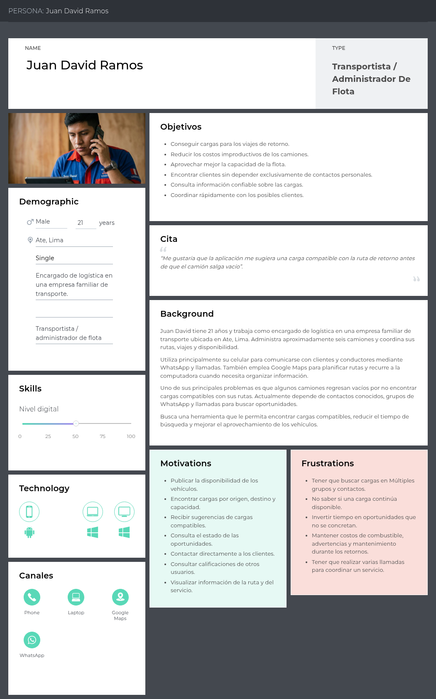
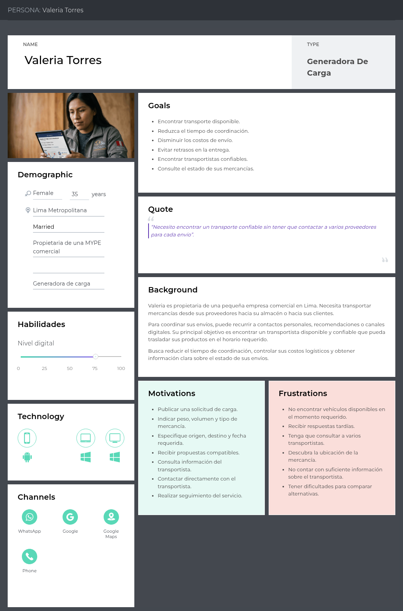
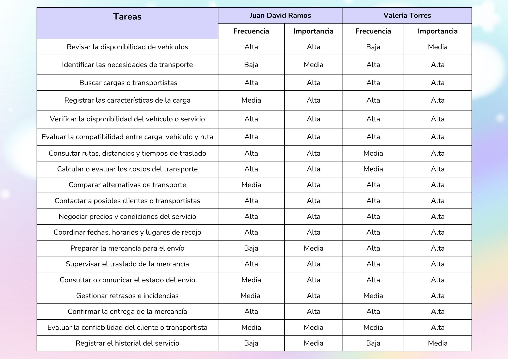
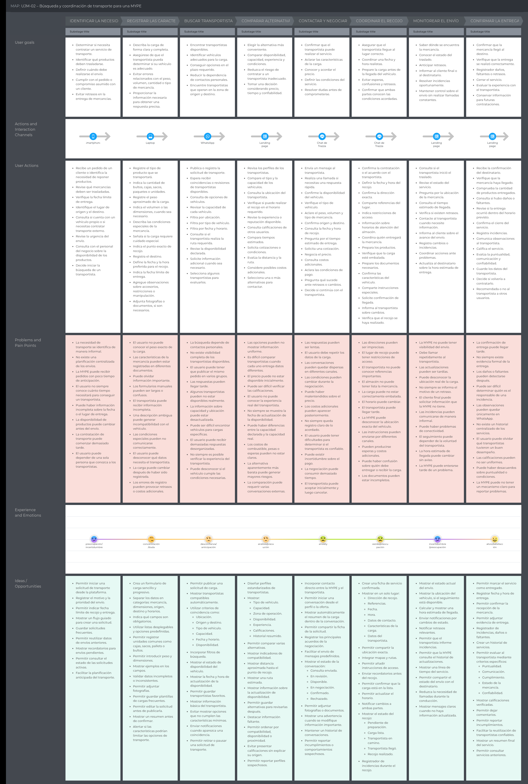
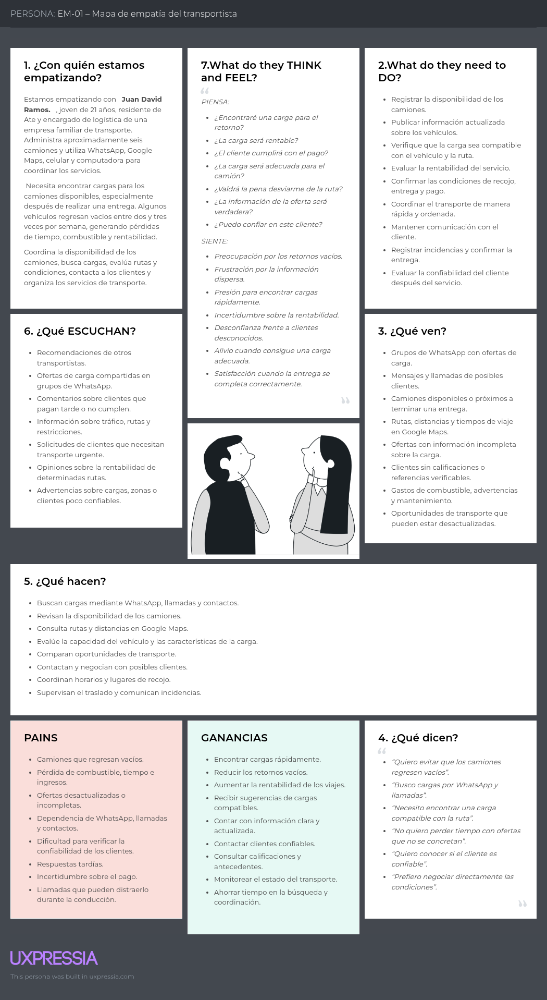
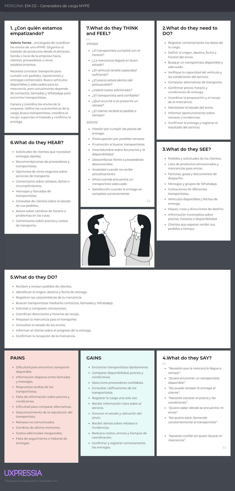

## 2.3.Needfinding
El Needfinding es una actividad fundamental de la ingeniería de requisitos que permite identificar las necesidades, problemas, expectativas y actividades de los usuarios antes de definir las funcionalidades del sistema. En el proyecto Trazza, esta etapa busca comprender cómo los transportistas y las MYPE generan, buscan y coordinan servicios de transporte actualmente.
Para ello, se emplean herramientas de análisis centradas en el usuario, como User Personas, User Task Matrix, User Journey Mapping, Empathy Mapping y As-is Scenario Mapping. Estos artefactos permiten reconocer dificultades del proceso actual y establecer oportunidades de mejora que servirán como base para la definición de requisitos funcionales y no funcionales de la plataforma.

### 2.3.1 User Personas
#### User Persona del Segmento Objetivo 1: Transportistas de Carga Terrestre

#### User Persona del Segmento Objetivo 2: Pequeños y Medianos Emprendedores

### 2.3.2 User Task Matrix

### 2.3.3 User Journey Mapping
#### User Persona 1: Juan David Ramos

#### User Persona 2: Valeria Torres

### 2.3.4 Empathy Mapping
#### User Persona 1: Juan David Ramos

#### User Persona 2: Valeria Torres

<!-- Salto de Pagina -->

### 2.3.5 As-is Scenario Mapping

#### Escenario As-Is 1: Transportista buscando carga de retorno 
 
| | Detectar la necesidad |  Buscar cargas disponibles |  Evaluar oportunidad | Contactar y negociar | Aceptar y coordinar | Realizar el traslado |  Finalizar y evaluar |
|---|---|---|---|---|---|---|---|
| **Doing** | Termina su entrega, revisa qué otros camiones están disponibles y consulta su ubicación y ruta de retorno. | Revisa grupos de WhatsApp, escribe a contactos, llama para preguntar por cargas de retorno y compara las primeras ofertas. | Revisa origen y destino, calcula peso/volumen, estima combustible y compara si el trayecto conviene. | Envía mensajes, llama, negocia precio y condiciones, confirma horarios y decide si acepta. | Confirma el servicio, coordina fecha/hora de recojo, verifica dirección y prepara el vehículo. | Recoge la carga, se dirige al destino, consulta la ruta y responde llamadas del cliente. | Confirma la entrega, comunica incidencias y decide si volvería a trabajar con ese cliente. |
| **Thinking** | "Ya entregué, pero no sé si voy a conseguir algo para el regreso." "¿Vale la pena esperar o mejor me voy vacío?" | "¿A quién más le pregunto?" "Esta oferta se ve rara, ¿será real?" | "¿Esto realmente me deja ganancia o termino perdiendo?" "No conozco a este cliente, ¿será confiable?" | "¿Por qué se demora tanto en responder?" "Ojalá no me cambie las condiciones a última hora." | "Espero que la dirección esté completa esta vez." "¿Seguirá disponible la carga cuando llegue?" | "Espero no perder señal en este tramo." "¿Por qué me llama otra vez, ya le dije que voy en camino?" | "Esta vez salió bien, pero no tengo dónde guardar este contacto para la próxima." |
| **Feeling** | Incertidumbre / preocupación | Desconfianza / anticipación | Vigilancia / precaución | Ansiedad | Aceptación (con tensión) | Concentración / vigilancia | Satisfacción / tranquilidad |
 

 
#### Escenario As-Is 2: MYPE buscando y coordinando transporte 
 
| | Identificar necesidad | Registrar características | Buscar transportista | Comparar alternativas |  Contactar y negociar | Coordinar recojo | Monitorear envío | Confirmar entrega |
|---|---|---|---|---|---|---|---|---|
| **Doing** | Recibe un pedido, revisa qué mercancía debe trasladar y consulta si tiene vehículo propio disponible. | Describe la carga, estima peso y volumen, indica condiciones especiales y adjunta fotos si es necesario. | Publica la solicitud en grupos o contactos, filtra opciones por ubicación y tipo de vehículo. | Revisa perfiles, compara capacidad, tiempos estimados y solicita cotizaciones a varios transportistas. | Escribe o llama a cada transportista, repite los datos de la carga y negocia precio y pago. | Confirma dirección, horario de recojo, prepara los productos y comparte instrucciones especiales. | Pregunta reiteradamente por la ubicación, contacta al transportista y actualiza al destinatario. | Verifica que la mercancía llegó completa, cierra el servicio y decide si recontrataría. |
| **Thinking** | "Necesito transporte y no sé cuánto tiempo me va a tomar conseguirlo." | "¿Le estoy dando toda la información que el transportista necesita?" | "¿Quién tiene disponibilidad justo ahora en mi zona?" | "Este es más barato, pero ¿será confiable?" | "Ya expliqué todo esto tres veces distintas." "¿Y si acepta y después cancela?" | "Espero que llegue puntual y que entienda bien la dirección." | "¿Dónde va el camión ahora? Nadie me avisa nada." | "Salió bien, pero no me queda un registro de este transportista para la próxima vez." |
| **Feeling** | Preocupación / incertidumbre | Concentración / duda | Desconfianza / anticipación | Análisis / precaución | Ansiedad | Estrés / preocupación | Incertidumbre / preocupación | Alivio / satisfacción |