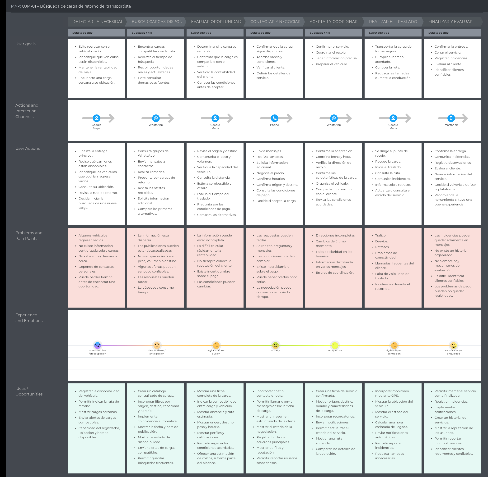

## 2.3. Needfinding

El Needfinding es una actividad fundamental de la ingeniería de requisitos que permite identificar las necesidades, problemas, expectativas y actividades de los usuarios antes de definir las funcionalidades del sistema. En el proyecto Trazza, esta etapa busca comprender cómo los transportistas y las MYPE generan, buscan y coordinan servicios de transporte actualmente.
Para ello, se emplean herramientas de análisis centradas en el usuario, como User Personas, User Task Matrix, User Journey Mapping, Empathy Mapping y As-is Scenario Mapping. Estos artefactos permiten reconocer dificultades del proceso actual y establecer oportunidades de mejora que servirán como base para la definición de requisitos funcionales y no funcionales de la plataforma.

### 2.3.1 User Personas
#### User Persona del Segmento Objetivo 1: Transportistas de Carga Terrestre

#### User Persona del Segmento Objetivo 2: Pequeños y Medianos Emprendedores

### 2.3.2 User Task Matrix

### 2.3.3 User Journey Mapping
#### User Persona 1: Juan David Ramos

#### User Persona 2: Valeria Torres

### 2.3.4 Empathy Mapping
#### User Persona 1: Juan David Ramos

#### User Persona 2: Valeria Torres

### 2.3.5 As-is Scenario Mapping
