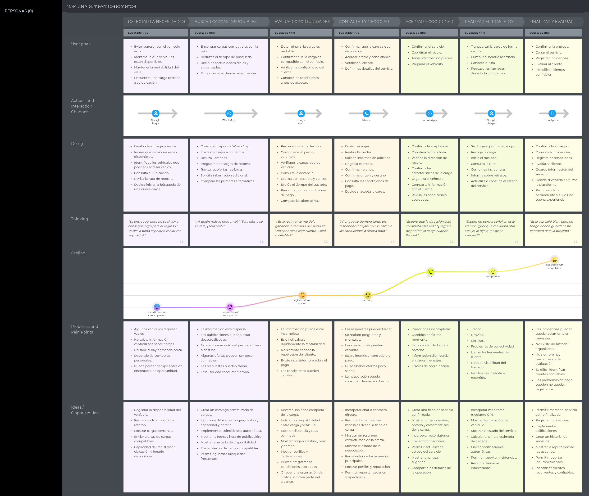
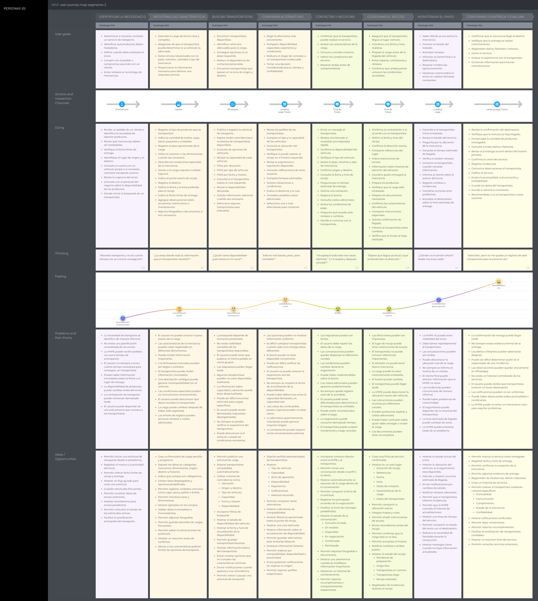
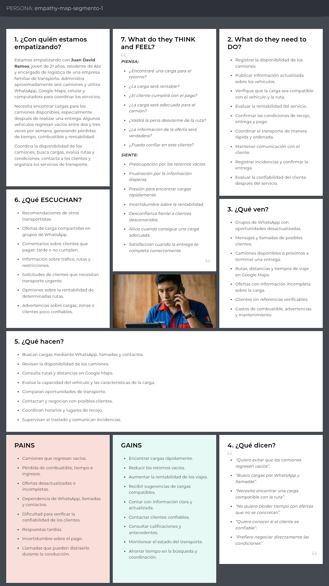
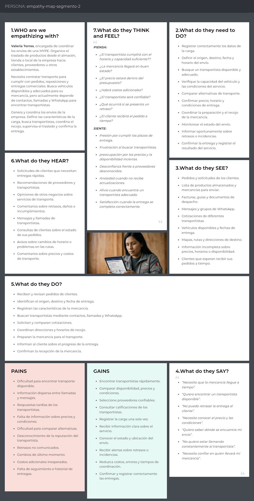

## 2.3. Needfinding
El Needfinding es una actividad fundamental de la ingeniería de requisitos que permite identificar las necesidades, problemas, expectativas y actividades de los usuarios antes de definir las funcionalidades del sistema. En el proyecto Trazza, esta etapa busca comprender cómo los transportistas y las MYPE generan, buscan y coordinan servicios de transporte actualmente.
Para ello, se emplean herramientas de análisis centradas en el usuario, como User Personas, User Task Matrix, User Journey Mapping, Empathy Mapping y As-is Scenario Mapping. Estos artefactos permiten reconocer dificultades del proceso actual y establecer oportunidades de mejora que servirán como base para la definición de requisitos funcionales y no funcionales de la plataforma.

### 2.3.1 User Personas
A continuación, se presentan los arquetipos de nuestros segmentos objetivos. La construcción de estos User Personas se basó directamente en la información recolectada durante las entrevistas, tomando en cuenta las principales frustraciones, motivaciones y el nivel de digitalización de los usuarios. Además, se consideró el análisis de la competencia para identificar qué carencias actuales en el mercado podrían ser resueltas para estos perfiles. Cada ficha incluye información demográfica, metas, marcas afines y su principal problemática logística.

#### User Persona del Segmento Objetivo 1: Transportistas de Carga Terrestre

> *Fuente: Elaboración propia en [UXPressia - User Persona: Juan David Ramos](https://uxpressia.com/w/v8FzI/p/XLeV6)*

 

#### User Persona del Segmento Objetivo 2: Pequeños y Medianos Emprendedores

> *Fuente: Elaboración propia en [UXPressia - User Persona: Valeria Torres](https://uxpressia.com/w/v8FzI/p/KVlW7)*

 

### 2.3.2 User Task Matrix
En esta sección se presenta el User Task Matrix, el cual concentra las tareas clave que los representantes de cada segmento (Transportistas y Emprendedores MYPE) realizan para cumplir sus objetivos logísticos. Estas tareas reflejan las actividades del mundo real que se ejecutan independientemente de nuestra futura solución de software.

**Análisis de tareas:**
Al comparar ambos perfiles, observamos que las tareas con mayor frecuencia e importancia para el Emprendedor MYPE son la "Búsqueda de transportistas" y el "Monitoreo del envío", dado que de ello depende la satisfacción de su cliente final. Por su parte, para el Transportista, la "Búsqueda de carga de retorno" y la "Negociación de tarifas" son críticas, ya que impactan directamente en su rentabilidad. 
Una coincidencia importante es que ambos segmentos dedican mucho esfuerzo a la "Coordinación de tiempos y recojo". La principal diferencia radica en el enfoque de seguridad: el emprendedor teme por el estado de su mercadería, mientras que el transportista teme la informalidad del pago o asaltos en ruta.

 

### 2.3.3 User Journey Mapping
A continuación se presentan las versiones As-Is de los User Journey Maps, es decir, el recorrido actual que experimenta cada usuario para lograr su objetivo sin la existencia de nuestra plataforma. Para el Transportista, se ilustra el viaje desde que finaliza un servicio hasta que intenta conseguir una carga de retorno para no viajar vacío. Para el Emprendedor MYPE, se ilustra el proceso desde que recibe un pedido hasta que logra coordinar y verificar la entrega del mismo.

#### User Persona 1: Juan David Ramos

> *Fuente: Elaboración propia en [UXPressia - User Journey Map: Juan David Ramos](https://uxpressia.com/w/v8FzI/m/1H5VY)*

 

#### User Persona 2: Valeria Torres

> *Fuente: Elaboración propia en [UXPressia - User Journey Map: Valeria Torres](https://uxpressia.com/w/v8FzI/m/rEbN7)*

 

### 2.3.4 Empathy Mapping
Para la elaboración de estos Empathy Maps, el equipo analizó las respuestas y el lenguaje corporal de los usuarios durante las entrevistas. Colocando al User Persona en el centro, mapeamos sus percepciones respondiendo a: ¿Qué está diciendo y haciendo en su día a día?, ¿Qué escucha de sus colegas o clientes?, y ¿Qué ve en su entorno laboral? Posteriormente, identificamos sus *Pains* (frustraciones por procesos manuales, pérdida de dinero, inseguridad) y sus *Gains* (lo que esperan lograr y cómo una solución tecnológica podría convencerlos al resolver sus problemas).

#### User Persona 1: Juan David Ramos

> *Fuente: Elaboración propia en [UXPressia - Empathy Map: Juan David Ramos](https://uxpressia.com/w/v8FzI/p/K9mve)*

 

#### User Persona 2: Valeria Torres

> *Fuente: Elaboración propia en [UXPressia - Empathy Map: Valeria Torres](https://uxpressia.com/w/v8FzI/p/SQmML)*

 

<!-- Salto de Pagina -->

### 2.3.5 As-is Scenario Mapping

#### Escenario As-Is 1: Transportista buscando carga de retorno 
 
| | Detectar la necesidad |  Buscar cargas disponibles |  Evaluar oportunidad | Contactar y negociar | Aceptar y coordinar | Realizar el traslado |  Finalizar y evaluar |
|---|---|---|---|---|---|---|---|
| **Doing** | Termina su entrega, revisa qué otros camiones están disponibles y consulta su ubicación y ruta de retorno. | Revisa grupos de WhatsApp, escribe a contactos, llama para preguntar por cargas de retorno y compara las primeras ofertas. | Revisa origen y destino, calcula peso/volumen, estima combustible y compara si el trayecto conviene. | Envía mensajes, llama, negocia precio y condiciones, confirma horarios y decide si acepta. | Confirma el servicio, coordina fecha/hora de recojo, verifica dirección y prepara el vehículo. | Recoge la carga, se dirige al destino, consulta la ruta y responde llamadas del cliente. | Confirma la entrega, comunica incidencias y decide si volvería a trabajar con ese cliente. |
| **Thinking** | "Ya entregué, pero no sé si voy a conseguir algo para el regreso." "¿Vale la pena esperar o mejor me voy vacío?" | "¿A quién más le pregunto?" "Esta oferta se ve rara, ¿será real?" | "¿Esto realmente me deja ganancia o termino perdiendo?" "No conozco a este cliente, ¿será confiable?" | "¿Por qué se demora tanto en responder?" "Ojalá no me cambie las condiciones a última hora." | "Espero que la dirección esté completa esta vez." "¿Seguirá disponible la carga cuando llegue?" | "Espero no perder señal en este tramo." "¿Por qué me llama otra vez, ya le dije que voy en camino?" | "Esta vez salió bien, pero no tengo dónde guardar este contacto para la próxima." |
| **Feeling** | Incertidumbre / preocupación | Desconfianza / anticipación | Vigilancia / precaución | Ansiedad | Aceptación (con tensión) | Concentración / vigilancia | Satisfacción / tranquilidad |
 
 

#### Escenario As-Is 2: MYPE buscando y coordinando transporte 
 
| | Identificar necesidad | Registrar características | Buscar transportista | Comparar alternativas |  Contactar y negociar | Coordinar recojo | Monitorear envío | Confirmar entrega |
|---|---|---|---|---|---|---|---|---|
| **Doing** | Recibe un pedido, revisa qué mercancía debe trasladar y consulta si tiene vehículo propio disponible. | Describe la carga, estima peso y volumen, indica condiciones especiales y adjunta fotos si es necesario. | Publica la solicitud en grupos o contactos, filtra opciones por ubicación y tipo de vehículo. | Revisa perfiles, compara capacidad, tiempos estimados y solicita cotizaciones a varios transportistas. | Escribe o llama a cada transportista, repite los datos de la carga y negocia precio y pago. | Confirma dirección, horario de recojo, prepara los productos y comparte instrucciones especiales. | Pregunta reiteradamente por la ubicación, contacta al transportista y actualiza al destinatario. | Verifica que la mercancía llegó completa, cierra el servicio y decide si recontrataría. |
| **Thinking** | "Necesito transporte y no sé cuánto tiempo me va a tomar conseguirlo." | "¿Le estoy dando toda la información que el transportista necesita?" | "¿Quién tiene disponibilidad justo ahora en mi zona?" | "Este es más barato, pero ¿será confiable?" | "Ya expliqué todo esto tres veces distintas." "¿Y si acepta y después cancela?" | "Espero que llegue puntual y que entienda bien la dirección." | "¿Dónde va el camión ahora? Nadie me avisa nada." | "Salió bien, pero no me queda un registro de este transportista para la próxima vez." |
| **Feeling** | Preocupación / incertidumbre | Concentración / duda | Desconfianza / anticipación | Análisis / precaución | Ansiedad | Estrés / preocupación | Incertidumbre / preocupación | Alivio / satisfacción |

