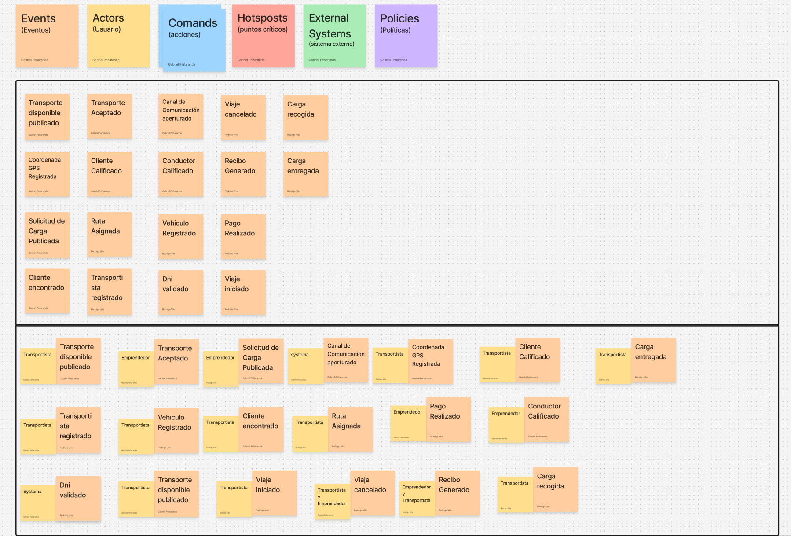
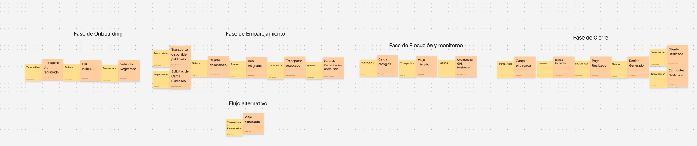
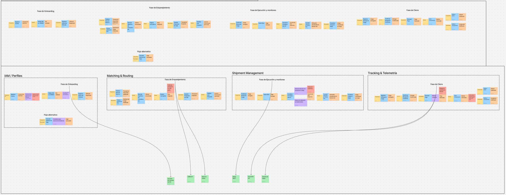

## 2.4. Big Picture Event Storming

El Big Picture Event Storming es un taller de diseño colaborativo que permite modelar los flujos de negocio mediante la identificación de eventos de dominio, comandos, actores y sistemas externos. Para Trazza, esta técnica nos ayuda a descubrir el comportamiento del sistema logístico desde diferentes perspectivas.

A continuación, se presenta el esquema visual del Event Storming:

 

 

> *Fuente: Elaboración propia en [Figma - Big Picture Event Storming](https://www.figma.com/board/WxMU6oKF4Vo3Z5UQ5XZrkm/Sin-t%C3%ADtulo?node-id=0-1&t=yjmq4uC9nUQyFJMh-1)*

### Narrativas de Negocio

A partir de este análisis, se han derivado las siguientes narrativas principales que describen el comportamiento esperado del sistema:

**Narrativa 1: El Retorno Rentable (Perspectiva del Transportista)**
Carlos finaliza una descarga en Lurín y no quiere volver con la tolva vacía hasta su cochera en Los Olivos. Abre Trazza y ejecuta Publicar Ruta de Retorno. En segundos, el motor de grafos cruza su trayecto y dispara Cliente encontrado. Carlos revisa la distancia del desvío, decide pulsar Aceptar Propuesta de Viaje y se traslada al almacén de la MYPE. Al llegar, presiona Confirmar Recojo de Carga, arranca el motor (Viaje iniciado) y se incorpora a la Panamericana Sur sabiendo que su retorno ya está cubierto económicamente.

**Narrativa 2: Despacho Confiable y Trazable (Perspectiva de la MYPE)**
Lucía administra un taller textil en San Juan de Lurigancho y necesita trasladar 12 fardos de tela hacia una tienda en el Centro de Lima. Publica la solicitud con peso y volumen requeridos (Solicitud de Carga Publicada). El sistema le notifica una coincidencia compatible y le abre el canal de mensajería integrado. Lucía observa que el transportista cuenta con DNI validado y calificación superior a 4 estrellas. Una vez completado el trayecto, Lucía recibe la mercadería, presiona Confirmar Recepción Conforme, procesa el abono del flete y califica positivamente el servicio.

**Narrativa 3: Alerta de Desvío en Ruta (Políticas de Telemetría IoT)**
El camión avanza por la Vía de Evitamiento emitiendo ráfagas periódicas de posición (Coordenada GPS Registrada). Para esquivar un bloqueo imprevisto, el conductor toma un atajo hacia una zona no planificada. Al superar el umbral de los 2 km de desvío respecto a la polilínea calculada por OpenRouteService, la política de monitoreo se activa en segundo plano y emite una notificación de advertencia al cliente. El conductor retoma la ruta principal antes del límite de tiempo, el sistema restablece el estado de alerta a normal y la entrega concluye con la confirmación de la carga en destino.

**Narrativa 4: Cancelación Temprana y Compensación (Flujo Alternativo)**
Un comerciante solicita un flete de urgencia, pero 20 minutos antes de la hora fijada para el recojo decide anular la operación pulsando Cancelar Solicitud de Viaje. La plataforma evalúa la política de penalidades: al ocurrir con el transportista ya en trayecto hacia el punto de carga, el sistema cobra una tasa de compensación básica al solicitante por lucro cesante, envía una notificación de liberación inmediata al camión y vuelve a dejar disponible el retorno del transportista en el motor de emparejamiento para que intente capturar otra carga cercana.