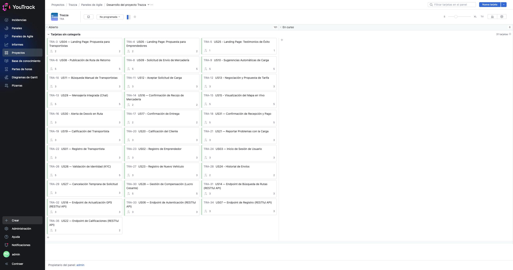
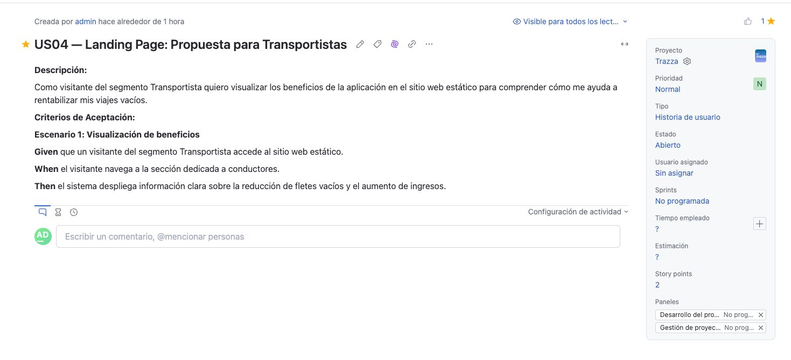
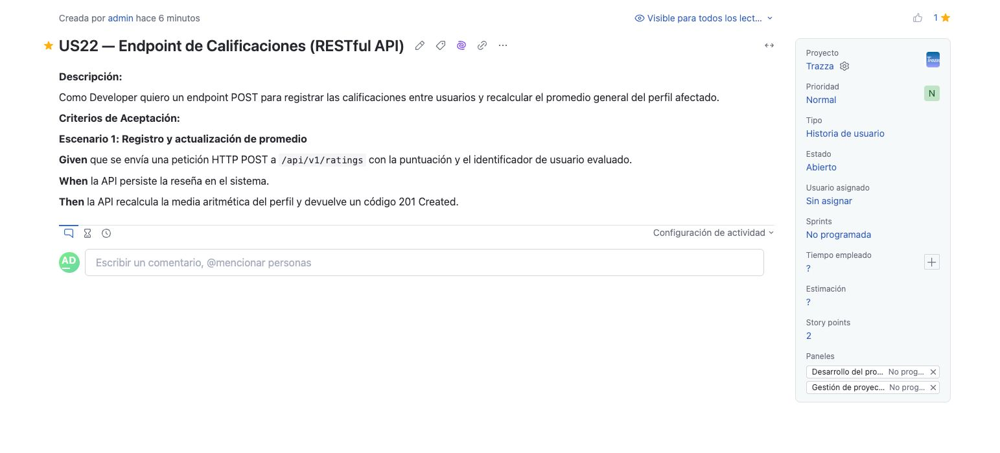

## 3.3. Product Backlog

En esta sección se presenta el Product Backlog del proyecto, priorizando el valor entregado para el negocio y garantizando que las historias de usuario relacionadas con el Landing Page y las transacciones centrales del negocio sean atendidas tempranamente. La gestión del backlog, así como la estimación en *Story Points* basada en la escala de Fibonacci (1, 2, 3, 5, 8), se ha llevado a cabo utilizando la herramienta YouTrack.

| Orden | User Story Id | Título | Descripción | Story Points (1 / 2 / 3 / 5 / 8) |
|---|---|---|---|---|
| 1 | US04 | Landing Page: Propuesta para Transportistas | Como visitante del segmento Transportista quiero visualizar los beneficios de la aplicación en el sitio web estático para comprender cómo me ayuda a rentabilizar mis viajes vacíos. | 2 |
| 2 | US05 | Landing Page: Propuesta para Emprendedores | Como visitante del segmento Emprendedor quiero identificar cómo la plataforma asegura mis envíos en el sitio web estático para decidir registrarme con total confianza. | 2 |
| 3 | US25 | Landing Page: Testimonios de Éxito | Como visitante del segmento Emprendedor quiero leer testimonios de otros usuarios en el sitio web estático para validar la credibilidad de la plataforma. | 1 |
| 4 | US08 | Publicación de Ruta de Retorno | Como transportista de carga terrestre quiero publicar mi ruta de regreso y la capacidad disponible de mi vehículo para recibir solicitudes de carga compatibles. | 5 |
| 5 | US09 | Solicitud de Envío de Mercadería | Como pequeño o mediano emprendedor quiero solicitar el envío de mis productos especificando peso y destino para encontrar transportistas con espacio libre en dicha ruta. | 5 |
| 6 | US10 | Sugerencias Automáticas de Carga | Como transportista de carga terrestre quiero recibir sugerencias automáticas de carga compatibles con mi ruta de retorno para no viajar con el flete vacío. | 5 |
| 7 | US11 | Búsqueda Manual de Transportistas | Como pequeño emprendedor quiero buscar transportistas disponibles especificando fechas y rutas para elegir la mejor opción. | 3 |
| 8 | US12 | Aceptar Solicitud de Carga | Como transportista de carga terrestre quiero aceptar una solicitud de carga sugerida para asegurar el viaje de retorno. | 3 |
| 9 | US13 | Negociación y Propuesta de Tarifa | Como pequeño emprendedor quiero proponer una tarifa por el envío al transportista para llegar a un acuerdo económico directo. | 3 |
| 10 | US29 | Mensajería Integrada (Chat) | Como pequeño emprendedor quiero disponer de un canal de chat integrado en la plataforma para comunicarme con el transportista emparejado y coordinar rápidamente los pormenores del recojo. | 5 |
| 11 | US16 | Confirmación de Recojo de Mercadería | Como transportista de carga terrestre quiero marcar en la aplicación cuando haya recogido la carga para iniciar formalmente el monitoreo del viaje. | 2 |
| 12 | US15 | Visualización del Mapa en Vivo | Como pequeño emprendedor quiero ver la ubicación de mi mercadería en un mapa en tiempo real para tener tranquilidad durante el traslado. | 5 |
| 13 | US30 | Alerta de Desvío en Ruta | Como pequeño emprendedor quiero recibir una notificación automática si el camión se desvía más de 2 kilómetros de la ruta planificada para estar alerta ante posibles riesgos o retrasos. | 3 |
| 14 | US17 | Confirmación de Entrega | Como transportista de carga terrestre quiero confirmar que la mercadería ha sido entregada en el destino para finalizar el viaje y habilitar las calificaciones. | 2 |
| 15 | US31 | Confirmación de Recepción y Pago | Como pequeño emprendedor quiero confirmar la recepción conforme de la mercadería desde mi aplicación para validar el servicio y procesar el abono del flete correspondiente. | 5 |
| 16 | US19 | Calificación del Transportista | Como pequeño emprendedor quiero calificar de 1 a 5 estrellas al transportista tras finalizar un viaje para ayudar a construir su reputación en la plataforma. | 3 |
| 17 | US20 | Calificación del Cliente | Como transportista de carga terrestre quiero calificar al emprendedor según su nivel de cumplimiento y trato para alertar a otros conductores. | 3 |
| 18 | US21 | Reportar Problemas con la Carga | Como pequeño emprendedor quiero poder reportar un problema si mi mercadería llega dañada o incompleta para que la plataforma tome acciones de soporte. | 3 |
| 19 | US01 | Registro de Transportista | Como transportista de carga terrestre quiero registrar mis datos personales y los de mi vehículo en la plataforma para poder ofrecer mi disponibilidad en rutas de retorno. | 3 |
| 20 | US02 | Registro de Emprendedor | Como pequeño o mediano emprendedor quiero registrar los datos de mi empresa en la plataforma para poder buscar transportistas disponibles y coordinar envíos de mercadería. | 3 |
| 21 | US03 | Inicio de Sesión de Usuario | Como usuario registrado quiero iniciar sesión utilizando mis credenciales para acceder a las funcionalidades correspondientes a mi perfil. | 3 |
| 22 | US26 | Validación de Identidad (KYC) | Como administrador del sistema quiero requerir y validar el DNI de los transportistas durante su registro para garantizar un ecosistema seguro y confiable para los emprendedores. | 5 |
| 23 | US23 | Registro de Nuevo Vehículo | Como transportista de carga terrestre quiero añadir los datos de un nuevo camión a mi perfil para poder asignarlo a diferentes viajes. | 3 |
| 24 | US24 | Historial de Envíos | Como pequeño emprendedor quiero visualizar el historial de mis envíos pasados para llevar un control de mis operaciones logísticas. | 2 |
| 25 | US27 | Cancelación Temprana de Solicitud | Como pequeño emprendedor quiero anular mi solicitud de viaje antes del recojo de mercadería para suspender la operación ante imprevistos. | 3 |
| 26 | US28 | Gestión de Compensación (Lucro Cesante) | Como transportista de carga terrestre quiero recibir una compensación económica si el cliente cancela el servicio cuando ya me encuentro en ruta hacia el origen. | 5 |
| 27 | US14 | Endpoint de Búsqueda de Rutas (RESTful API) | Como Developer quiero un endpoint GET que devuelva una lista de rutas de retorno disponibles filtradas por origen y destino para mostrar los resultados en el cliente. | 3 |
| 28 | US18 | Endpoint de Actualización GPS (RESTful API) | Como Developer quiero un endpoint PATCH para actualizar periódicamente las coordenadas GPS de un viaje en curso para alimentar el mapa en vivo. | 3 |
| 29 | US06 | Endpoint de Autenticación (RESTful API) | Como Developer quiero un endpoint de inicio de sesión que valide credenciales y retorne un token JWT para proteger de forma segura las rutas privadas de la API. | 3 |
| 30 | US07 | Endpoint de Registro (RESTful API) | Como Developer quiero un endpoint para registrar nuevos usuarios que cifre las contraseñas antes de almacenarlas para garantizar la seguridad en la base de datos. | 3 |
| 31 | US22 | Endpoint de Calificaciones (RESTful API) | Como Developer quiero un endpoint POST para registrar las calificaciones entre usuarios y recalcular el promedio general del perfil afectado. | 2 |

### Evidencias de Gestión en YouTrack

A continuación, se presentan las capturas correspondientes al tablero ágil utilizado para el seguimiento y estimación de las historias de usuario.

 

 

> *Fuente: Elaboración propia en [YouTrack Agile Board](https://trazza.youtrack.cloud/agiles/204-1/current)*

