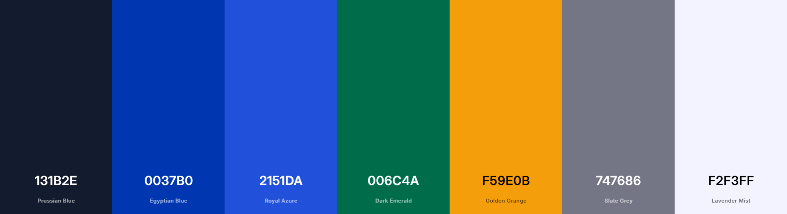

## 4.1. Style Guidelines

En esta sección, como equipo de estudiantes de 5to ciclo de Ingeniería de Software de la UPC, hemos establecido las bases para contar con un repositorio central y organizado de uso común (nuestro Design System). Nuestro objetivo es mantener una presentación visual consistente, profesional y enfocada que transmita fielmente la misión de **Trazza**: revolucionar y mejorar los sistemas de rutas vehiculares a nivel nacional, brindando seguridad, rentabilidad y eficiencia tanto a transportistas como a emprendedores.

A continuación, detallamos las guías generales y específicas para los entornos web, asegurando que la interfaz refleje la confiabilidad y precisión que nuestro rubro logístico exige.

### 4.1.1. General Style Guidelines

Nuestras decisiones sobre el estilo general se basan en principios de usabilidad orientados al trabajo operativo y logístico. Los elementos deben transmitir confianza inmediata, dinamismo y eficiencia.

#### A. Branding y Tono de Comunicación

El branding de Trazza busca establecer una conexión de confianza con usuarios que dependen de nosotros para su sustento económico. Por ello, hemos definido nuestro tono de comunicación con las siguientes dimensiones:
- **Ligeramente Formal (Formal vs. Casual):** Tratamos temas serios como dinero, rutas seguras y mercadería valiosa, pero manteniendo un vocabulario accesible para usuarios con distintos niveles de alfabetización digital.
- **Serio y Profesional (Divertido vs. Serio):** La logística no es un juego. La eficiencia de las entregas y la seguridad de las rutas son nuestra mayor promesa de valor.
- **Altamente Respetuoso (Respetuoso vs. Irreverente):** Valoramos profundamente el esfuerzo de los conductores de camiones en las carreteras y el arduo trabajo de los emprendedores MYPE.
- **Sereno y Directo (Entusiasta vs. Sereno):** La plataforma debe transmitir calma, control y dar respuestas claras, especialmente en situaciones de estrés (ej. desvíos de ruta, cancelaciones o tráfico).

#### B. Colors (Paleta de Colores)

Los colores seleccionados reflejan nuestra misión tecnológica: el azul profundo transmite seguridad corporativa y solidez, el verde indica confirmación (viajes completados, rutas óptimas), y los tonos oscuros garantizan una correcta legibilidad en cabinas de camiones (sometidas a luz solar intensa o a viajes nocturnos).

- **Primary Colors (Azules y Oscuros):** `#131B2E`, `#434655`, `#0037B0`. Utilizados para la identidad core, menús de navegación, textos principales (evitando el negro absoluto puro) y acciones primarias.
- **Secondary & Accent (Verdes y Naranjas):** `#006C4A`, `#85F8C4` (Éxito, tarifas aceptadas y rutas sin desviaciones), `#F59E0B` (Alertas IoT, espera de carga y desvíos de más de 2km).
- **Backgrounds & Neutrals:** `#FFFFFF`, `#F2F3FF`, `#EAEDFF`, `#747686`. Fondos limpios para separar las zonas del mapa de los paneles de administración y formularios de solicitudes.

#### C. Typography (Tipografía)

Nuestra tipografía principal es **Plus Jakarta Sans**. Es una fuente geométrica, moderna y extremadamente nítida, ideal para facilitar el escaneo rápido de datos críticos como coordenadas GPS, dimensiones de camiones, placas y montos de dinero.

  

    Plus Jakarta Sans
  

  

    <strong>Títulos y Encabezados (H1):</strong> ExtraBold (800) | Tamaño: 48px | Line-height: 60px | Letter-spacing: -1.2px
  

  

    <strong>Cuerpo de texto:</strong> Regular (400) | Tamaño: 16px | Interlineado relajado para legibilidad en listas de requerimientos y chats de coordinación.
  

#### D. Spacing y Geometría

Hemos implementado un sistema de espaciado basado en el múltiplo de **8px** (8, 16, 24, 32, 48, etc.). Esta escala matemática otorga un ritmo visual organizado, emulando la precisión de un sistema de almacenes y rutas milimétricas. Los *Border-radius* de botones y tarjetas interactivas se han fijado en `8px` para dar una apariencia moderna pero estructurada y firme.

### 4.1.2. Web Style Guidelines

El entorno web de Trazza está concebido primariamente para el segmento **Emprendedor (MYPE)**, quien accederá desde un escritorio o tablet en su tienda/almacén para realizar búsquedas, despachar carga y monitorear el mapa en tiempo real de múltiples camiones a la vez.

- **Layout y Grid Responsivo:** Empleamos una grilla fluida (Flexbox y CSS Grid) de 12 columnas. Para las vistas de monitoreo, el componente del mapa interactivo ocupa proporciones de `7/12` o `8/12` del ancho total de la pantalla, dando la jerarquía visual necesaria al *core* del sistema (el seguimiento satelital de la ruta vehicular).
- **Jerarquía y Profundidad (Sombras):** Para los contenedores de tarjetas de envíos activos se utiliza una sombra paralela muy sutil (ej. `box-shadow: 0 4px 12px rgba(19, 27, 46, 0.08)`). Esto permite "elevar" las tarjetas de información sobre el fondo grisáceo pálido (`#F2F3FF`), guiando el ojo del usuario hacia las tareas pendientes o en negociación sin sobrecargar la vista.
- **Interacción y Feedback (Hover/Active states):** Dado que coordinar fletes implica compromisos económicos, las acciones de usuario están altamente retroalimentadas. Los botones primarios (ej. "Aceptar Cotización") transicionan suavemente del azul base (`#0037B0`) al azul brillante (`#2151DA`), y utilizan punteros claros para confirmar la *affordance* antes de realizar cualquier cambio irreversible en la base de datos de rutas.
