## 4.3. Landing Page UI Design.

En esta sección se presenta la propuesta de diseño de interfaz de usuario para el landing page de Trazza en su versión desktop. El objetivo es materializar las decisiones de arquitectura de la información y los lineamientos visuales en una experiencia digital clara, estructurada y orientada a resolver la problemática de los fletes vacíos en Lima Metropolitana.

A través de este diseño, se busca captar la atención de nuestros segmentos objetivo y guiarlos de manera progresiva desde el primer impacto visual hasta la conversión final, asegurando una interacción intuitiva en cada etapa del recorrido.

### 4.3.1. Landing Page Wireframe.

**Explicación para Desktop**

  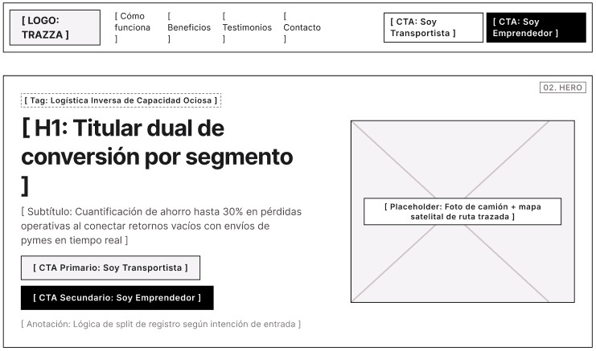
  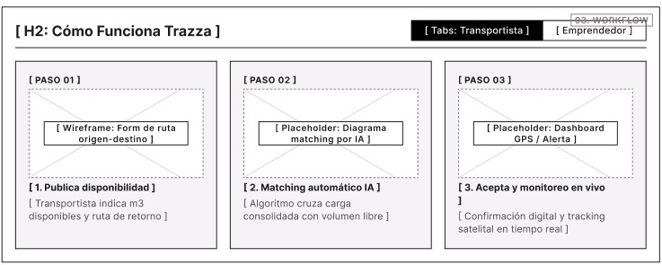
  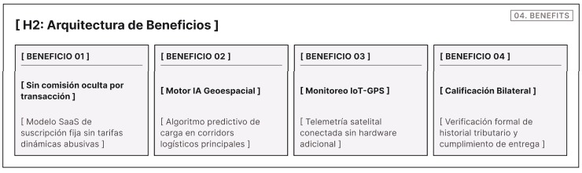
  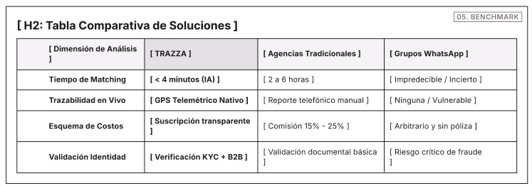
  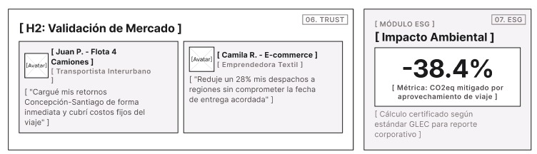
  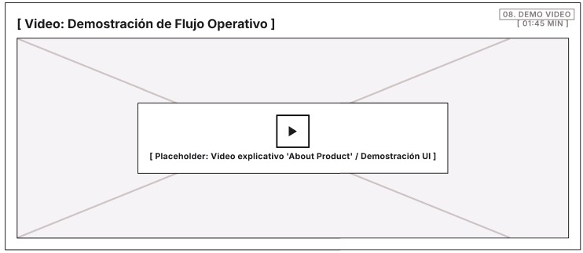
  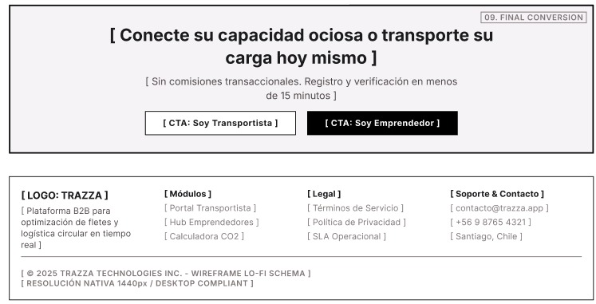

El diseño esquemático de la versión de escritorio está estructurado para guiar al usuario a través de un recorrido ordenado y persuasivo. Al abrir la página, se muestra una barra superior con el logotipo de Trazza, enlaces directos a las secciones principales y dos botones de llamada a la acción segmentados para transportistas y emprendedores. En el bloque principal se ubica el título enfocado en la logística inversa y la reducción de pérdidas operativas, junto con un espacio reservado para visualizar la ruta y el mapa.

A medida que el usuario baja en la página, encuentra la sección de funcionamiento en tres pasos detallados, seguida de la arquitectura de beneficios donde se exponen los pilares del servicio como el motor de IA y el monitoreo por GPS. Más abajo, se incluye una tabla comparativa frente a los métodos tradicionales e informales, las tarjetas con casos de éxito de usuarios reales en Lima y el bloque de impacto ambiental. Finalmente, la página cierra con un bloque de conversión directa y un pie de página corporativo que reúne los enlaces legales, de soporte y contacto.

### 4.3.2. Landing Page Mock-up.

**Explicación para Desktop**

  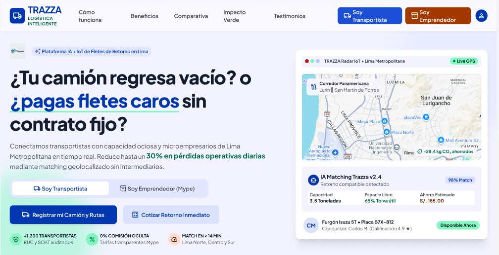
  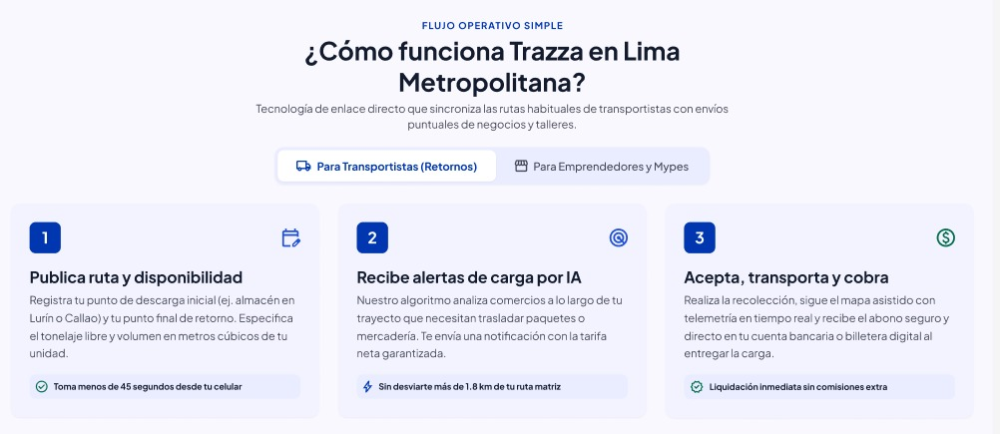
  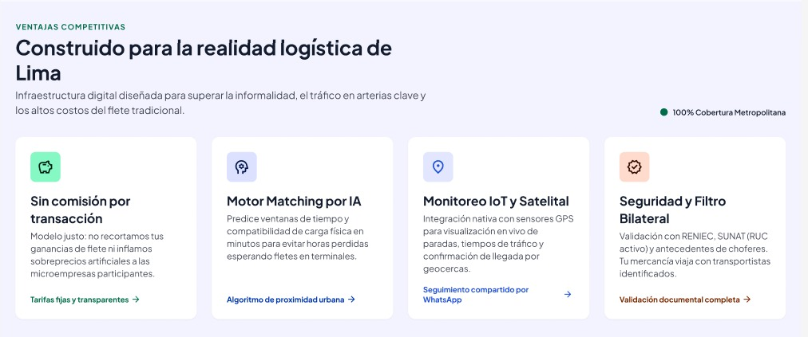
  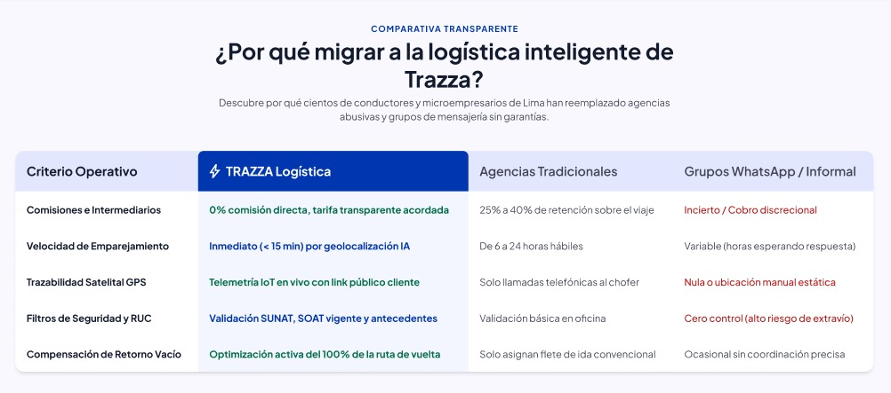
  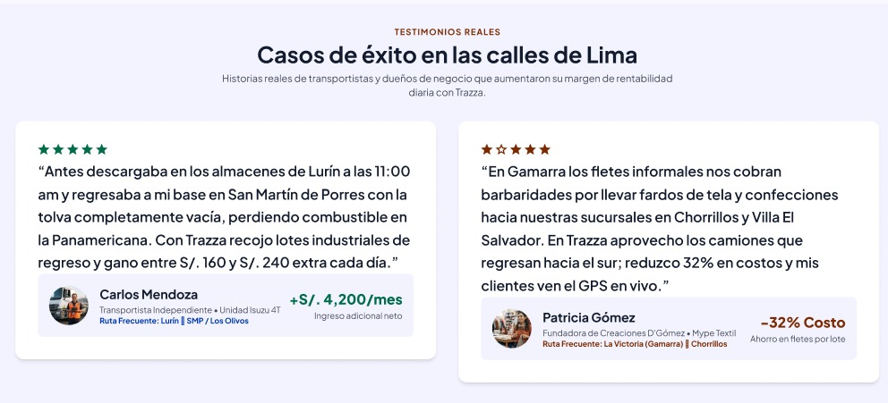
  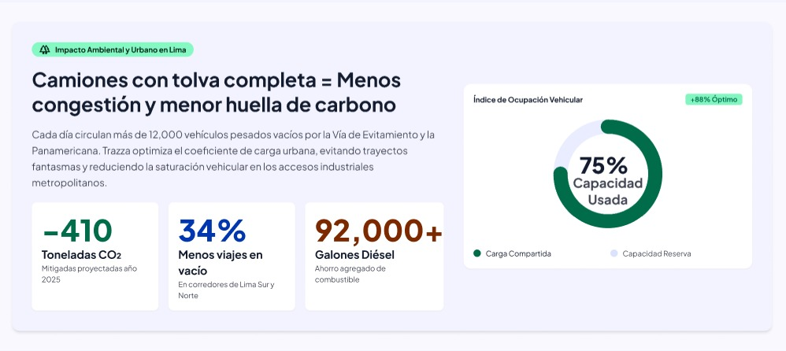
  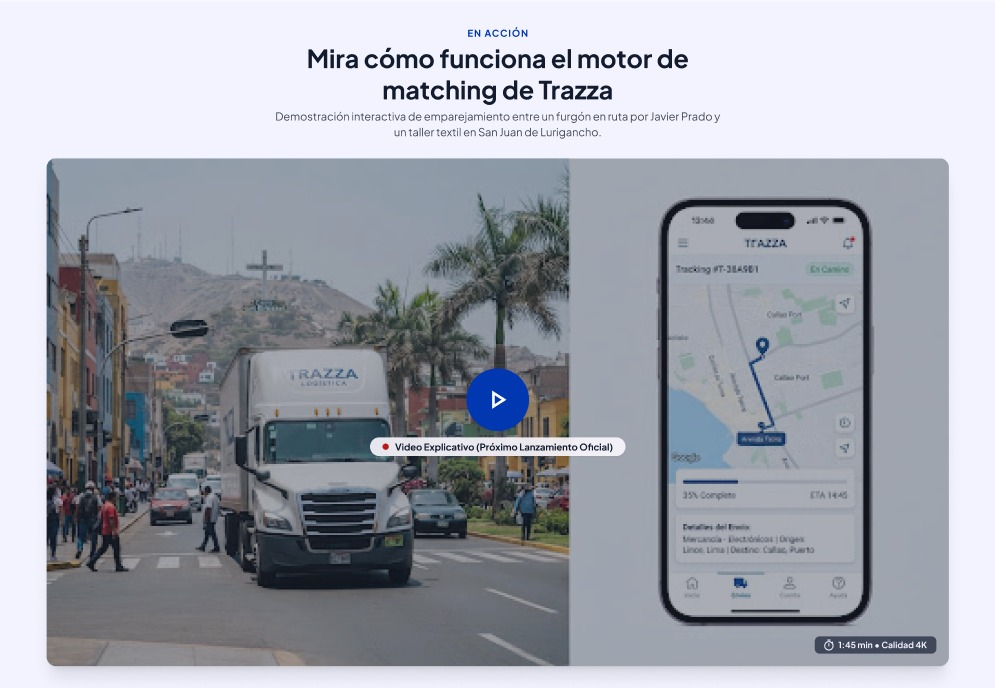
  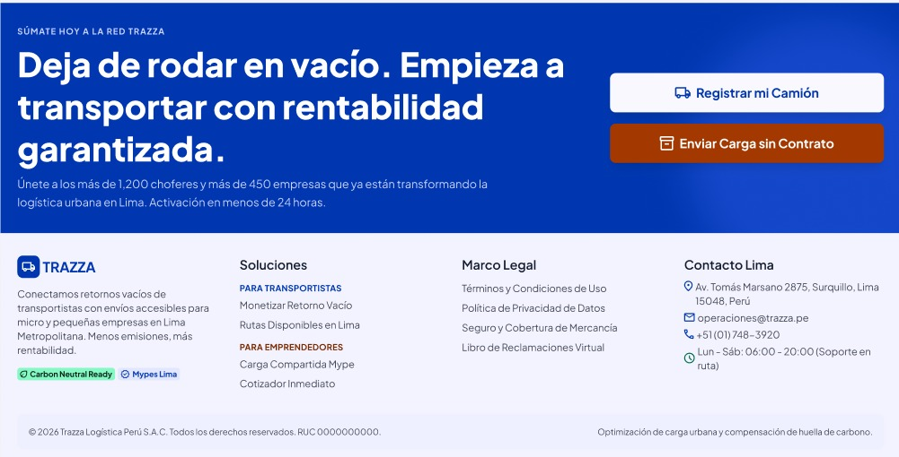

El diseño visual de la landing page aplica los lineamientos del Design System de Trazza, utilizando la paleta de colores corporativa y una tipografía limpia y legible. La interfaz inicia con el bloque principal que integra un panel interactivo de rastreo en tiempo real, acompañado de los accesos rápidos y métricas de confianza que respaldan la propuesta de valor de la plataforma.

En las siguientes secciones se muestran de forma visual el flujo operativo en tres pasos, la parrilla de ventajas competitivas, la tabla comparativa de mercado con sus respectivos contrastes y las opiniones de transportistas y emprendedores. El recorrido finaliza con la sección de impacto ambiental, un bloque con la demostración en video del motor de emparejamiento y el pie de página institucional, asegurando una experiencia profesional y orientada por completo a la conversión.
