## 4.4. Web Applications UX/UI Design.

El diseño de la experiencia de usuario (UX) y de la interfaz (UI) de la plataforma web **Trazza** se ha centrado en la operatividad y en la eficiencia logística. Entendemos que un transportista o un emprendedor MYPE utiliza la aplicación web buscando respuestas rápidas y sin fricciones en pantallas de escritorio. Por ello, la UX prioriza la visibilidad de las rutas, el estado de los envíos en tiempo real y la facilidad para negociar o auditar eventos pasados. La UI, basada en Material Design y optimizada mediante el Design System de la startup, utiliza una estética limpia y profesional que reduce la carga cognitiva mediante el uso estratégico de colores semánticos.

### 4.4.1. Web Applications Wireframes.

En esta sección se presentan todos los wireframes diseñados para la versión de escritorio de la plataforma Trazza, divididos por los módulos operativos principales (Subastas de Carga, Billetera/Liquidaciones y Rutas de Retorno).

**Wireframes Desktop - Subastas de Carga**

  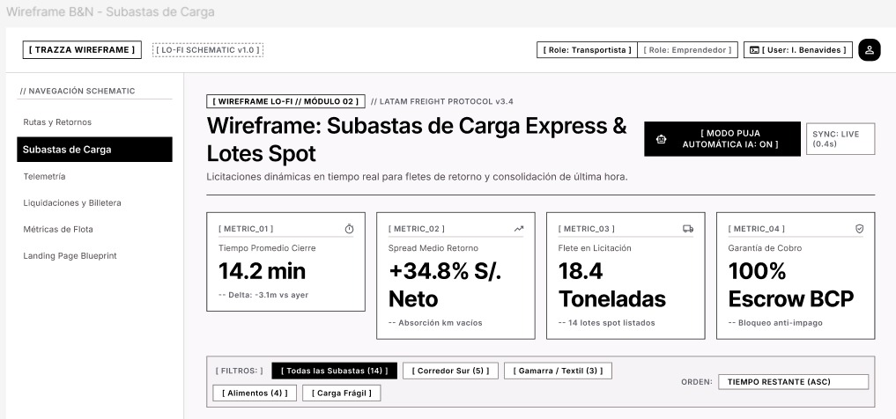
  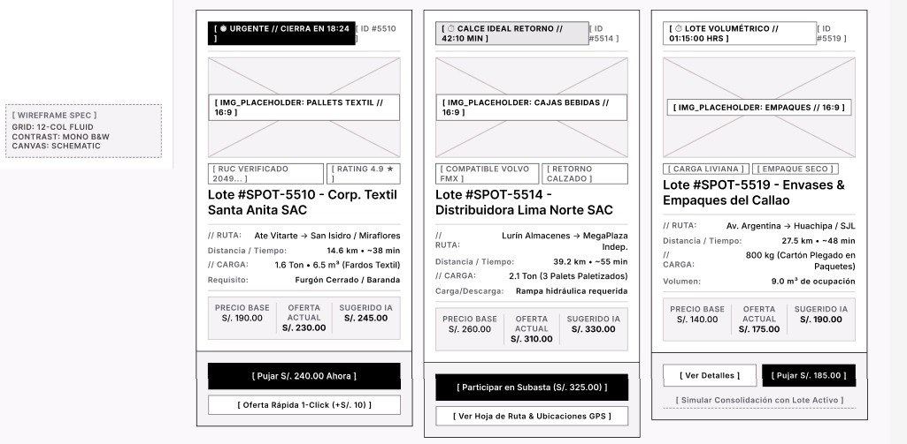
  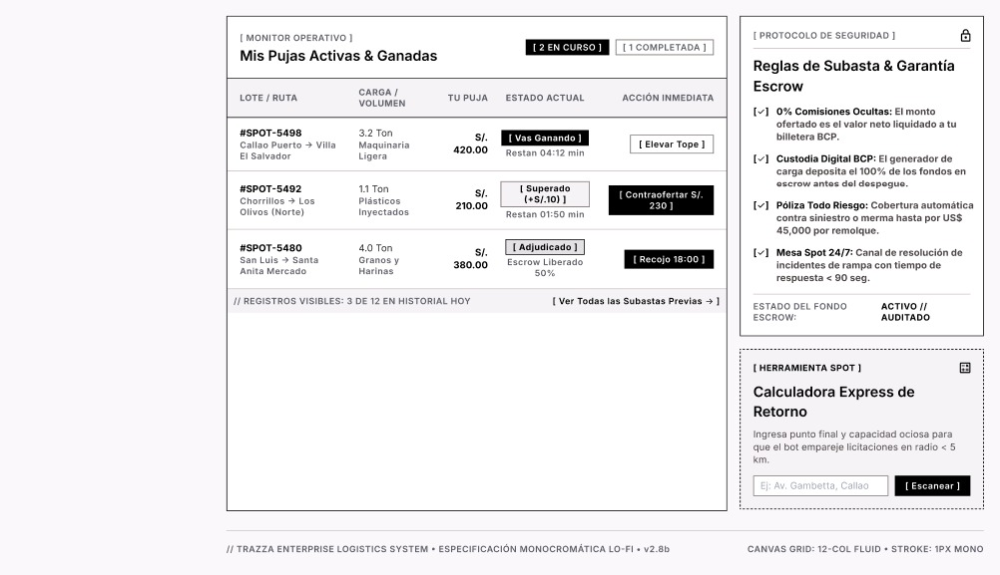

**Wireframes Desktop - Billetera y Liquidaciones**

  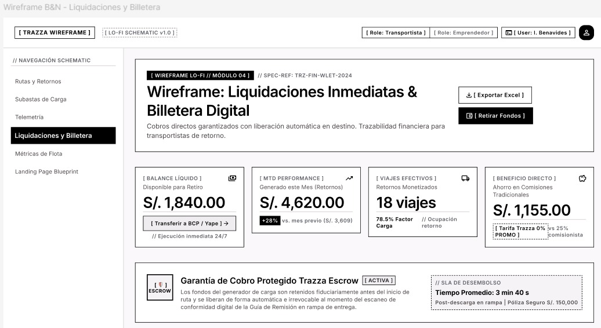
  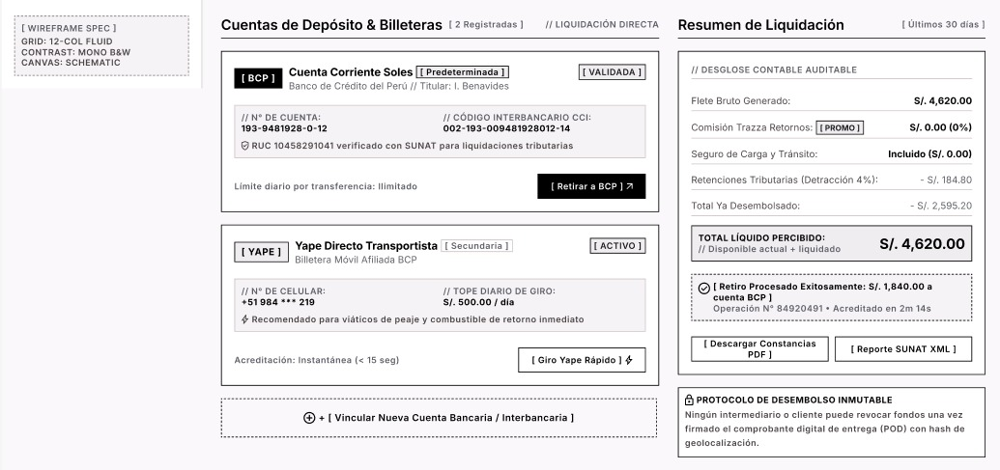
  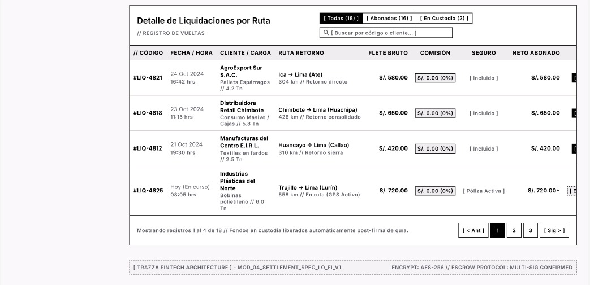

**Wireframes Desktop - Rutas y Retornos**

  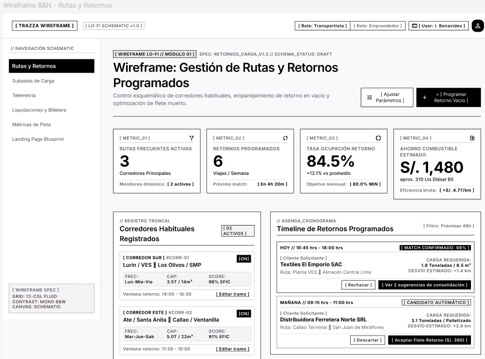
  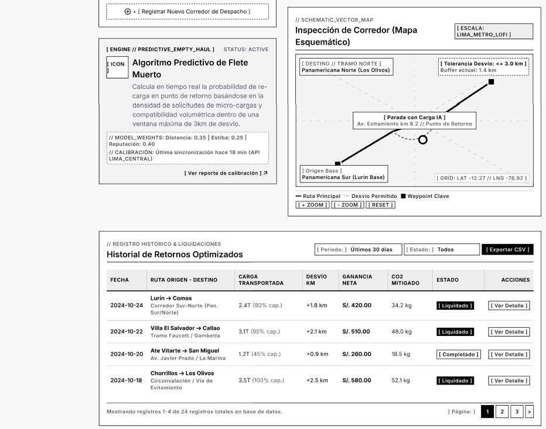

---

### 4.4.2. Web Applications Wireflow Diagrams.

El Wireflow combina la estructura de los wireframes con la lógica de un diagrama de flujo para visualizar la navegación del usuario en escritorio.

  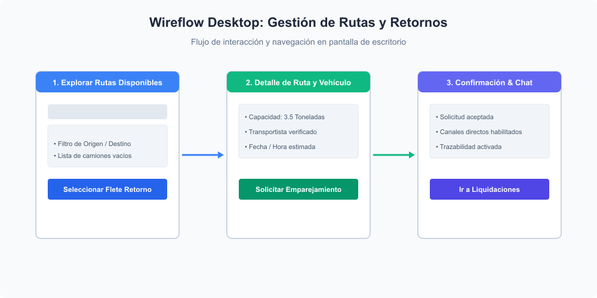

---

### 4.4.3. Web Applications Mock-ups.

Los mockups reflejan la identidad visual final de Trazza en alta fidelidad, organizados por cada módulo de la plataforma web de escritorio.

**Mockups Desktop - Subastas de Carga**

  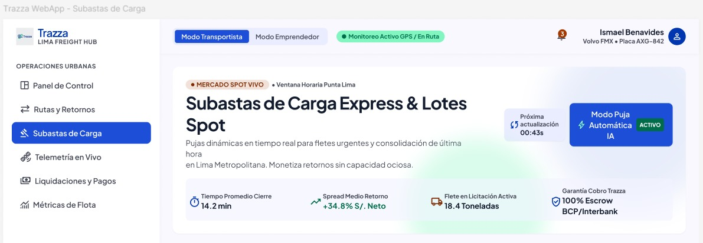
  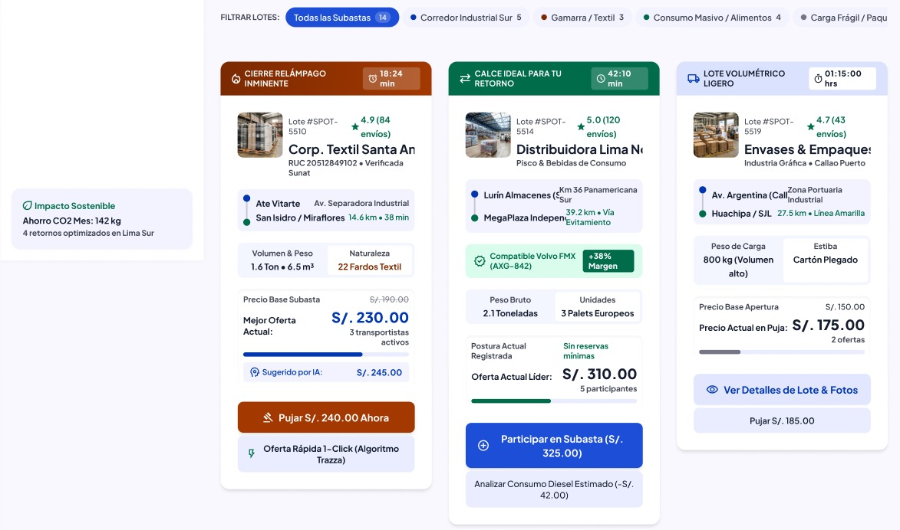
  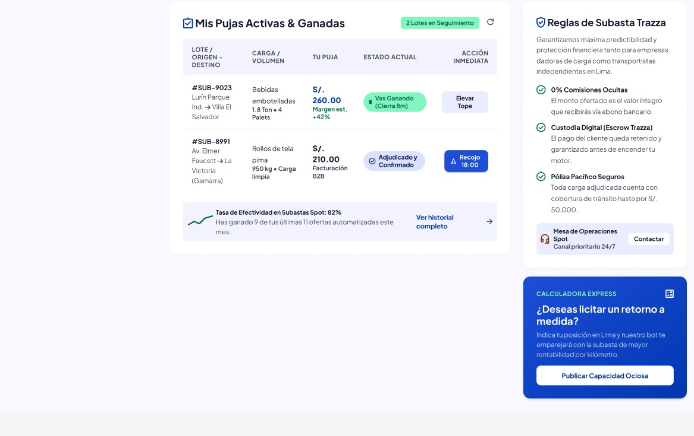

**Mockups Desktop - Billetera y Liquidaciones**

  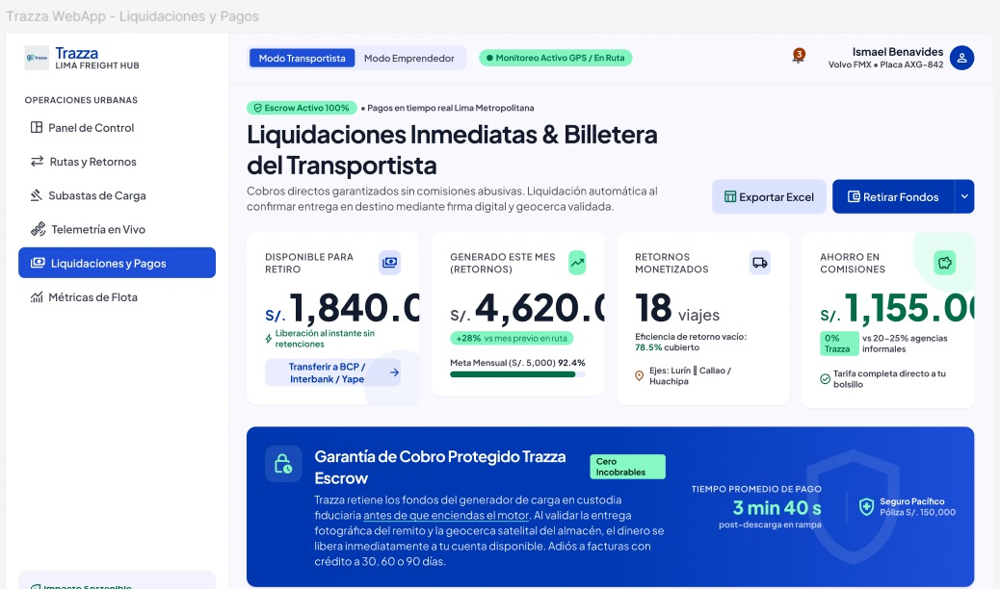
  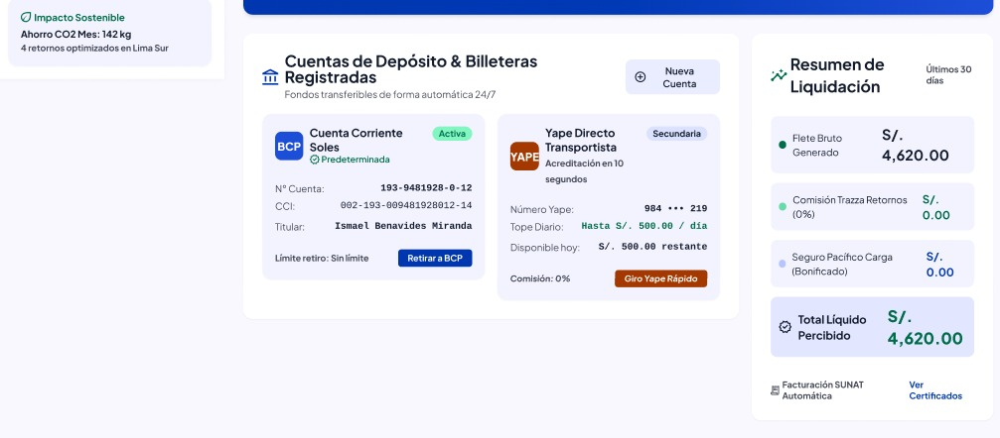
  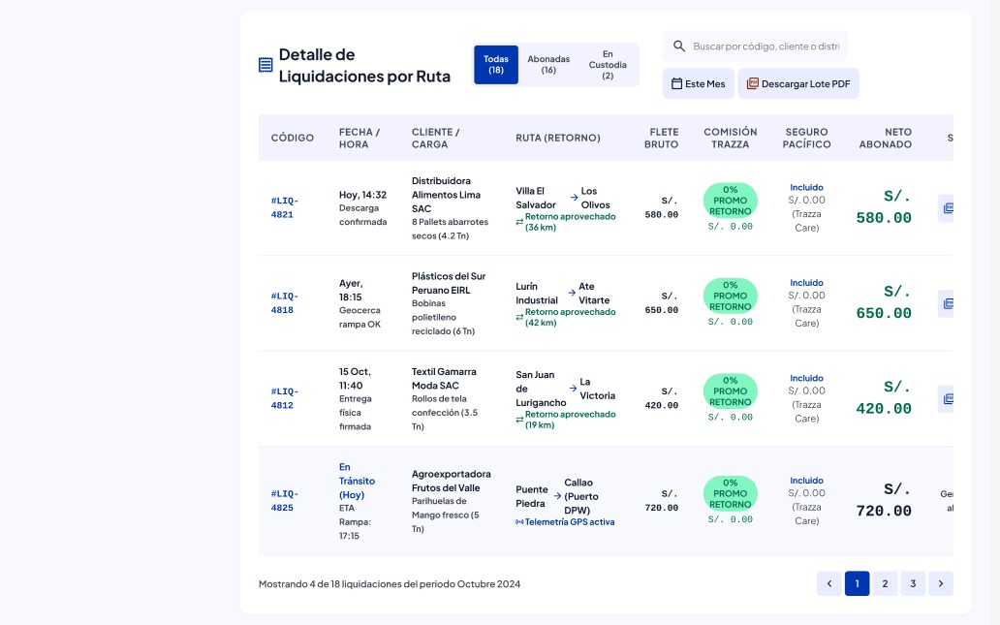

**Mockups Desktop - Rutas y Retornos**

  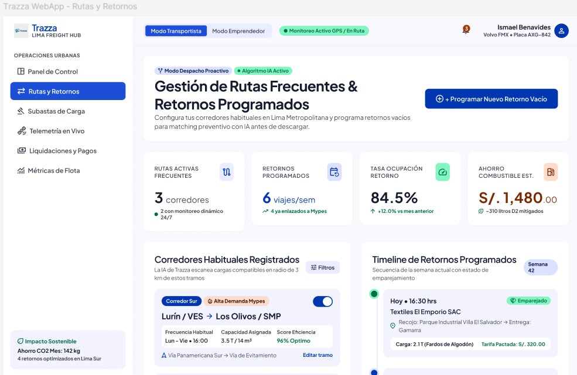
  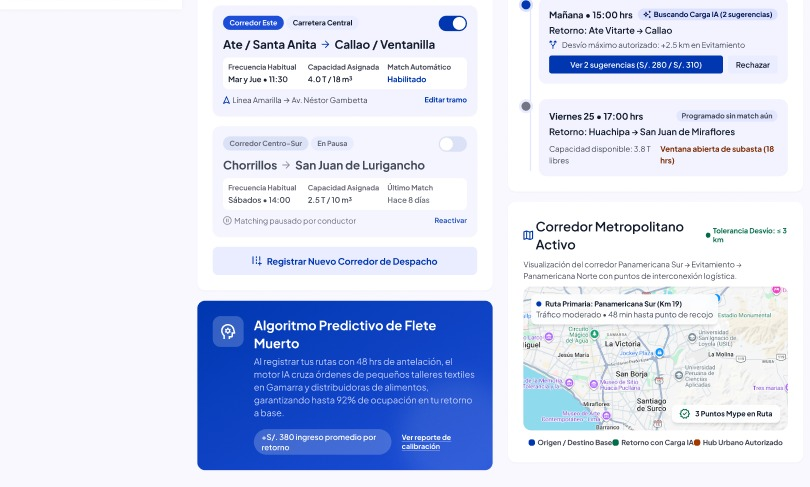
  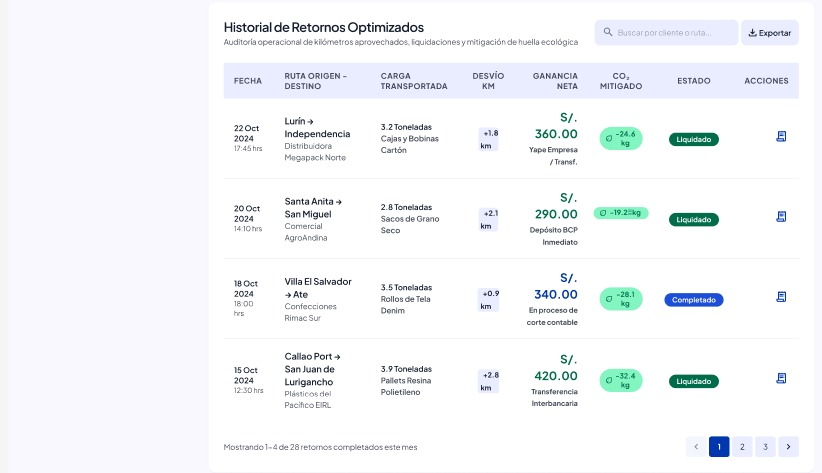

---

### 4.4.4. Web Applications User Flow Diagrams.

El User Flow detalla las rutas de decisión y los procesos que realiza el usuario dentro de la aplicación web en escritorio.

  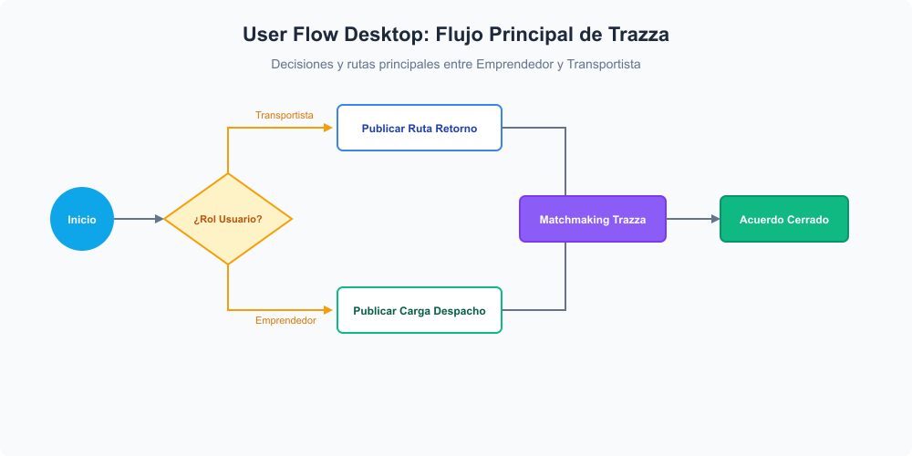

