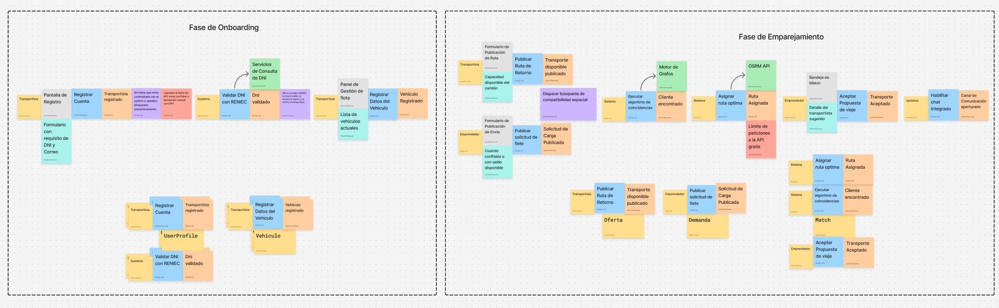
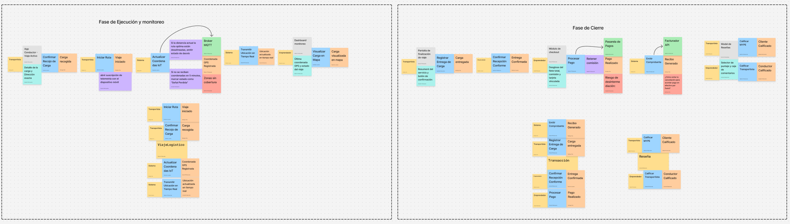
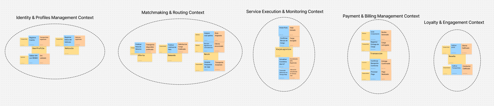
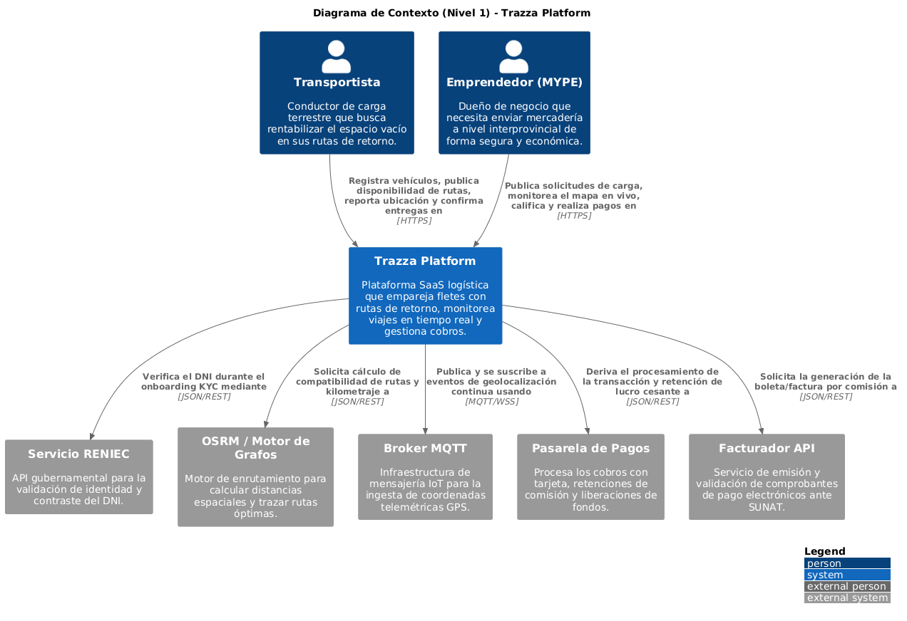
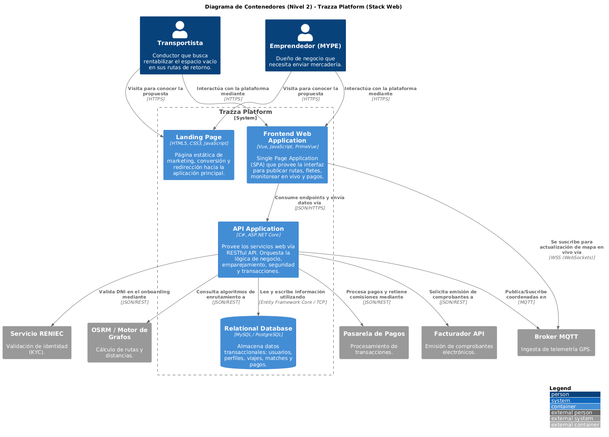

# 4.6. Domain-Driven Software Architecture

## 4.6.1. Design-Level Event Storming

> **Enlace de Figma:** [Event Storming](https://www.figma.com/board/WxMU6oKF4Vo3Z5UQ5XZrkm/Event-Storming?node-id=0-1&t=aqD0ryVwMf3WdoTD-1)

A continuación se detallan las entidades principales de Trazza, organizadas por Bounded Context, distinguiendo cuáles actúan como Raíz de Agregado (Aggregate Root) y cuáles son entidades hijas o Value Objects asociados:

### 1. Contexto: IAM & Perfiles (Identity & Profile Management)
- **Usuario (Aggregate Root):**
- **PerfilTransportista (Entidad / Aggregate Root):**
- **Vehiculo (Entidad dentro del agregado o Aggregate Root de Flota):**
- **PerfilEmprendedor (Entidad / Aggregate Root):**

### 2. Contexto: Matchmaking & Routing (Core Domain)
- **RutaRetorno (Aggregate Root):**
- **SolicitudEnvio (Aggregate Root):**
- **PropuestaMatch / Negociacion (Aggregate Root):**

### 3. Contexto: Service Execution & Monitoring (IoT & Tránsito)
- **ViajeLogistico / Shipment (Aggregate Root):**
- **Incidencia (Entidad hija dentro de ViajeLogistico):**

### 4. Contexto: Payment & Billing (Pagos)
- **TransaccionPago (Aggregate Root):**
- **Comprobante (Entidad / Aggregate Root):**

### 5. Contexto: Loyalty & Reputation (Calificaciones)
- **Calificacion (Aggregate Root):**

## 4.6.2. Software Architecture Context Diagram

A continuación se presenta el **Diagrama de Contexto** (Nivel 1), el cual ilustra de manera global la interacción de Trazza Platform con sus actores y sistemas externos.

## 4.6.3. Software Architecture Container Diagrams

Haciendo un acercamiento, el **Diagrama de Contenedores** (Nivel 2) detalla las aplicaciones principales que conforman el sistema y cómo se comunican entre sí.

## 4.6.4. Software Architecture Components Diagrams

Profundizando aún más, el **Diagrama de Componentes** (Nivel 3) hace un "zoom" dentro del contenedor API Application, enfocándose en el Bounded Context principal de Trazza: Matchmaking & Routing. Este diagrama demuestra cómo la arquitectura orientada a dominios se refleja en el código backend en C#.
