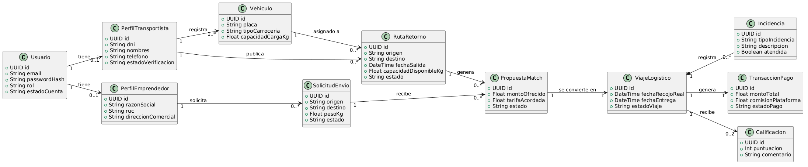

# 4.7. Software Object-Oriented Design

En esta sección, el equipo presenta los diagramas que detallan la implementación orientada a objetos de los componentes definidos en la arquitectura. La estructura refleja el uso del patrón arquitectónico de capas acoplado a Domain-Driven Design (DDD) bajo el framework ASP.NET Core (C#). 

Las principales características evidenciadas en estos diagramas son:
* **Uso de Inyección de Dependencias:** Acoplamiento débil a través de interfaces (`IService`, `IRepository`).
* **Separación de Responsabilidades:** Controladores para la capa de presentación (REST), Servicios para la lógica de negocio, y Repositorios para el acceso a datos mediante Entity Framework Core.
* **Agregados y Entidades de Dominio:** Clases ricas que encapsulan atributos y comportamientos clave del negocio.

## 4.7.1. Class Diagrams

A continuación se presenta el diagrama de clases correspondiente al Bounded Context Core de la plataforma: **Matchmaking & Routing**. Este diagrama ilustra cómo se estructura el emparejamiento entre la oferta (espacio en camiones) y la demanda (solicitudes de flete).

A continuación explicamos de manera sencilla cómo leer este diagrama y qué significa cada color:

**El significado de los colores:**
* **Celeste (Interfaces):** Son como "contratos". Definen qué acciones se pueden hacer (como buscar o guardar), pero sin decir cómo. Esto ayuda a que el código esté más ordenado y sea fácil de actualizar.
* **Amarillo (Aggregate Root):** Es la pieza principal y más importante. En este caso, el `Match` (Emparejamiento) es el líder que controla y agrupa a los demás elementos de esta sección.
* **Verde (Entidades):** Son objetos vitales que guardan información y tienen acciones propias, como la `RutaRetorno` del transportista y la `SolicitudCarga` del emprendedor.
* **Gris claro (Clases operativas):** Son las piezas que hacen el trabajo pesado, como recibir las peticiones de los usuarios (`MatchController`), hacer los cálculos del sistema (`MatchService`) o comunicarse con la base de datos (`MatchRepository`).

**El flujo del sistema (cómo trabajan en equipo):**
* **El Controlador (`MatchController`):** Funciona como un recepcionista. Recibe la petición del usuario desde la web y se la entrega al Servicio. No hace cálculos ni guarda datos por sí mismo.
* **El Servicio (`MatchService`):** Es el "cerebro". Aquí ocurren los cálculos complejos, como evaluar matemáticamente si una carga cabe en el camión y si las rutas coinciden.
* **El Repositorio (`MatchRepository`):** Es el bibliotecario. Es la única pieza del código que tiene permiso para ir a guardar o buscar la información definitiva en la base de datos.
* **El Dominio (`Match`, `RutaRetorno`, `SolicitudCarga`):** Son objetos inteligentes. En lugar de ser solo cajas vacías que guardan texto, contienen sus propias reglas. Por ejemplo, la clase `RutaRetorno` tiene su propia función matemática para descontar el peso (`RestarCapacidad()`) de forma segura.
