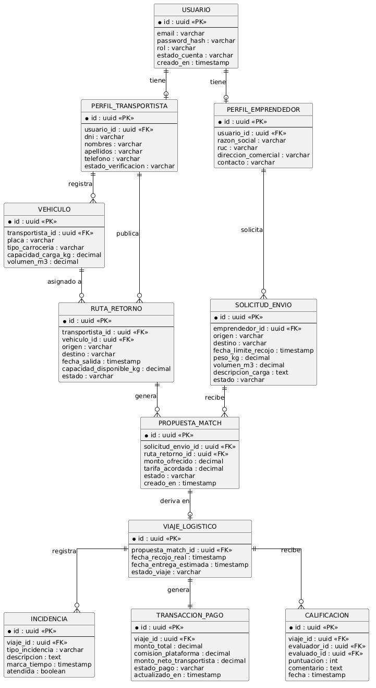

# 4.8. Database Design

En esta sección presentamos el diseño de la base de datos relacional que soporta la plataforma **Trazza**. El modelo ha sido estructurado para garantizar la integridad de los datos, evitar redundancias y reflejar fielmente las entidades clave del negocio.

## 4.8.1. Entity-Relationship Diagram (ERD)

A continuación se muestra el diagrama de Entidad-Relación (ERD), el cual detalla las tablas principales, sus atributos fundamentales (claves primarias y foráneas) y las relaciones entre ellas.

A continuación, explicamos de forma sencilla cómo está organizada nuestra base de datos:

**1. Gestión de Usuarios y Perfiles (Identidad):**
Todo comienza con la tabla `USUARIO`, que almacena las credenciales de acceso. Dependiendo del rol, un usuario puede tener un `PERFIL_TRANSPORTISTA` (quien conduce los camiones) o un `PERFIL_EMPRENDEDOR` (quien necesita enviar carga). Esta separación permite guardar datos específicos para cada tipo de cliente sin mezclar información.

**2. Operaciones Básicas (El Transporte):**
El transportista puede registrar uno o varios camiones en la tabla `VEHICULO`. A su vez, utilizando un vehículo específico, el transportista publica una `RUTA_RETORNO` indicando hacia dónde se dirige y cuánto espacio libre tiene en su camión. 
Por otro lado, el emprendedor publica una `SOLICITUD_ENVIO` detallando qué mercadería necesita transportar, su peso y destino.

**3. El Emparejamiento (Matchmaking):**
Cuando el sistema encuentra que una ruta y una solicitud son compatibles, se genera un registro en la tabla `PROPUESTA_MATCH`. Esta tabla conecta la necesidad del emprendedor con la disponibilidad del transportista e incluye la tarifa acordada.

**4. Ejecución del Viaje y Post-servicio:**
Una vez aceptado el acuerdo, este se convierte en un `VIAJE_LOGISTICO`, donde se registran las fechas reales de recojo y entrega. Durante el trayecto, si ocurre algún contratiempo, se puede registrar en la tabla `INCIDENCIA`. 
Al finalizar, se genera una `TRANSACCION_PAGO` que detalla el dinero a cobrar y las comisiones. Finalmente, los usuarios se califican mutuamente guardando su opinión en la tabla `CALIFICACION`, lo que ayuda a mantener la confianza en la plataforma.
