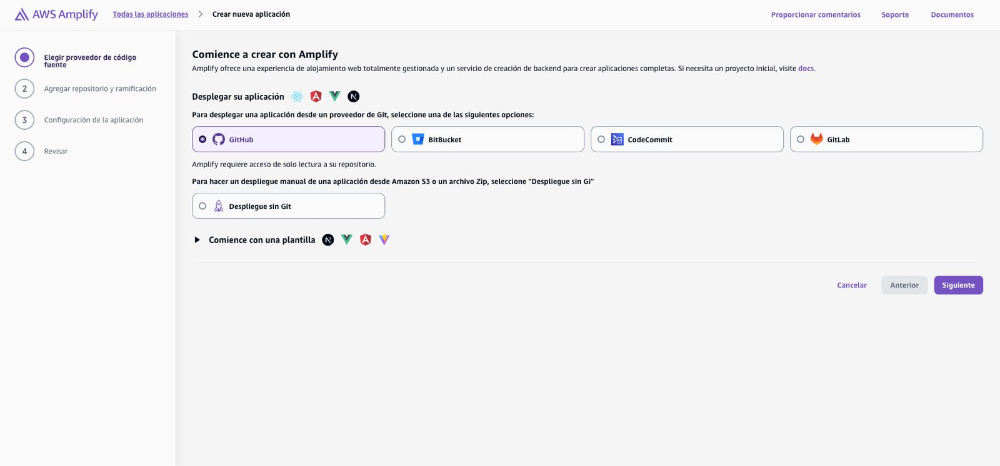
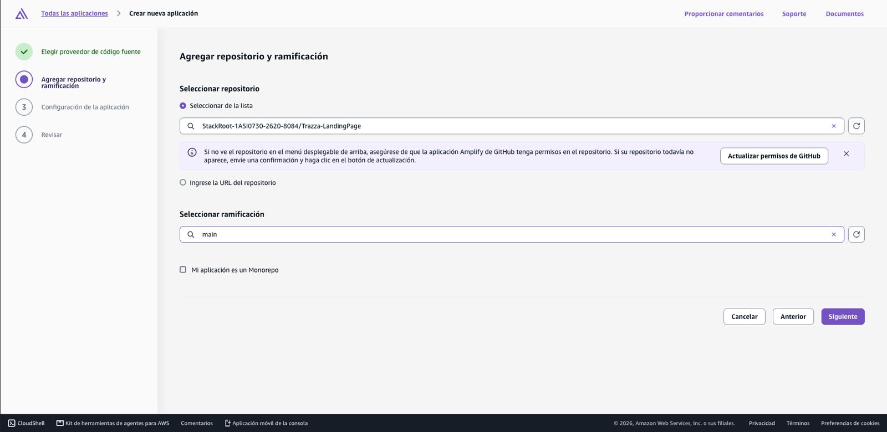
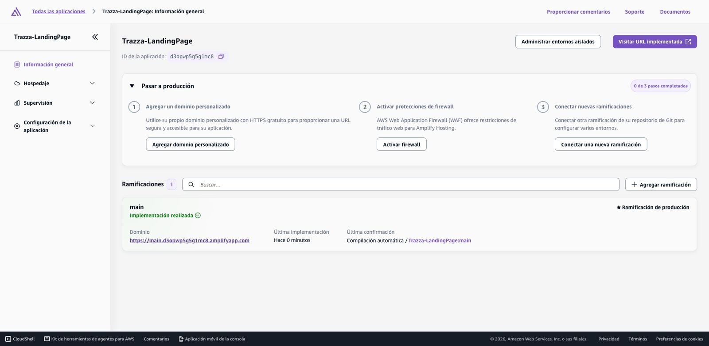
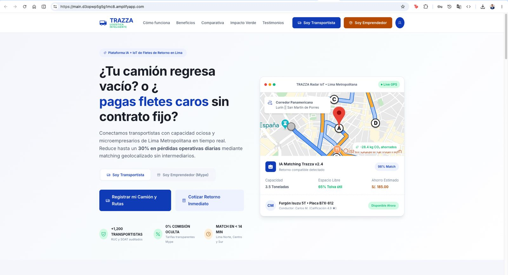
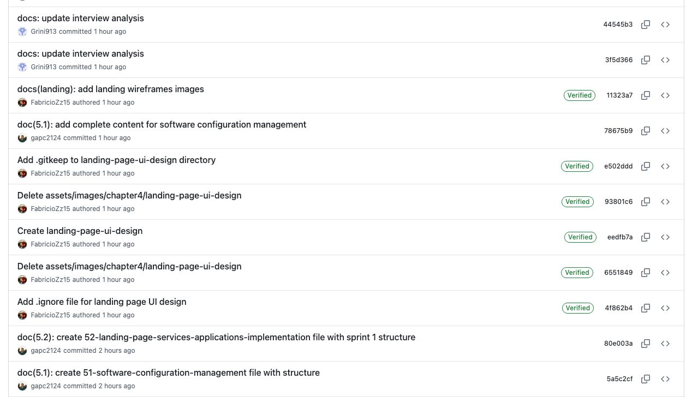
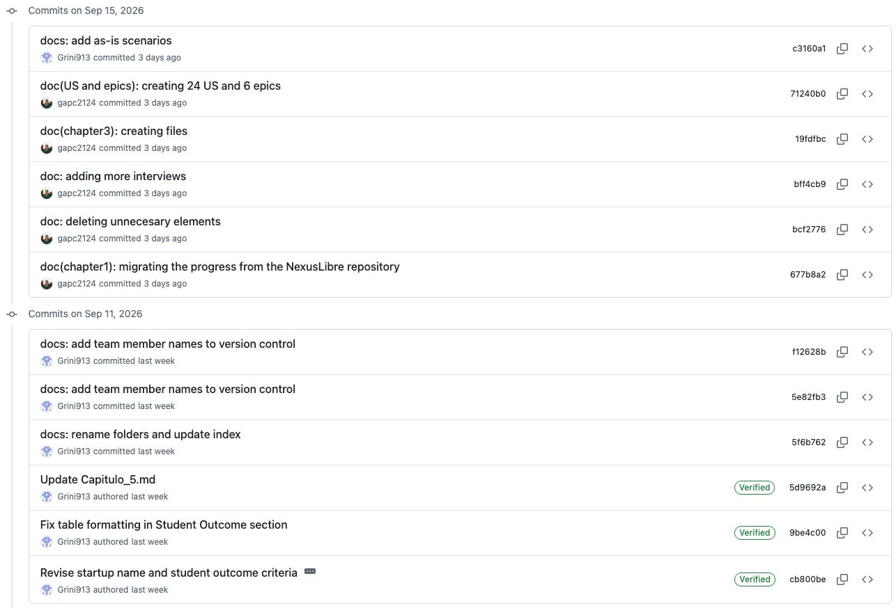

# 5.2. Landing Page, Services & Applications Implementation

En esta sección se explica y evidencia el proceso de implementación, pruebas, documentación y despliegue del Landing Page, Web Services y Frontend Web Applications. En esta sección se incluye, una vez que se cuenta con el Product Backlog, una sección interna cada Sprint (Sprint 1, Sprint 2, etc.).

## 5.2.1. Sprint 1

En esta sección se registra y explica el avance en términos de producto y trabajo colaborativo para el Sprint 1. Incluye como secciones internas: Sprint Planning 1, Aspect Leaders and Collaborators, Sprint Backlog 1, Development Evidence for Sprint Review, Execution Evidence for Sprint Review, Services Documentation Evidence for Sprint Review, junto con Team Collaboration Insights during Sprint.

### 5.2.1.1. Sprint Planning 1

En esta sección se especifican los aspectos principales del Sprint Planning Meeting. Se inicia la sección con una introducción y a continuación se coloca el cuadro de resumen del sprint planning meeting.

| Sprint # | Sprint 1 |
| :--- | :--- |
| **Sprint Planning Background** | |
| **Date** | 2026-09-18 |
| **Time** | 10:00 AM |
| **Location** | Reunión virtual vía Microsoft Teams |
| **Prepared By** | Peñaranda, Gabriel |
| **Attendees (to planning meeting)** | Peñaranda, Gabriel / Apellido1, Nombre1 / Apellido2, Nombre2 |
| **Sprint 1 – 1 Review Summary** | N/A (Al ser el primer Sprint del proyecto). |
| **Sprint 1 – 1 Retrospective Summary** | N/A (Al ser el primer Sprint del proyecto). |
| **Sprint Goal & User Stories** | |
| **Sprint 1 Goal** | Nuestro propósito es concebir y lanzar la versión inicial de la landing page para nuestro sistema de gestión de rutas, fundamentando su diseño en los hallazgos de las entrevistas realizadas a administradores y transportistas del sector logístico.Creemos que este entregable generará un impacto positivo y ofrecerá valor desde el primer contacto, transmitiendo con precisión la propuesta de valor del producto y la proyección estratégica de nuestra solución.Sabremos que hemos tenido éxito cuando los usuarios comprendan de manera intuitiva las ventajas clave de la plataforma y completen el formulario de contacto o soliciten más información de forma activa.|
| **Sprint 1 Velocity** | 5 Story Points. |
| **Sum of Story Points** | 15 Story Points. |

### 5.2.1.2. Aspect Leaders and Collaborators

En esta sección se incluye la elaboración de un artefacto Leadership-and-Collaboration Matrix (LACX), que indica por cada aspecto dentro del alcance del Sprint, quién es el líder y quién o quiénes son colaboradores en dicho aspecto. Esto brinda mayor efectividad en la comunicación al interior del equipo. Los aspectos elegidos para este Sprint son Landing Page (maquetación), Frontend Authentication (Vue) y Backend Auth Services (ASP.NET).

| Team Member (Last Name, First Name) | GitHub Username | Landing Page (HTML/CSS) | Frontend Auth (Vue) | Backend Auth (API) |
| :--- | :--- | :--- | :--- | :--- |
| Peñaranda, Gabriel | gabrielpenaranda | Leader (L) | Collaborator (C) | Collaborator (C) |
| Apellido1, Nombre1 | usuario1 | Collaborator (C) | Leader (L) | Collaborator (C) |
| Apellido2, Nombre2 | usuario2 | Collaborator (C) | Collaborator (C) | Leader (L) |

### 5.2.1.3. Sprint Backlog 1

El objetivo principal de este Sprint 1 es implementar la primera interacción del usuario con Trazza: la Landing Page y el módulo de registro/autenticación. A continuación, se presenta un screenshot del Board para el Sprint en la herramienta de control, junto con la tabla de User Stories asignadas y sus Tasks.

[URL público del Board: https://youtrack.jetbrains.com/trazza-board/sprint-1]

*(Insertar imagen del tablero de YouTrack/Trello para el Sprint 1 aquí)*

| Sprint # | Sprint 1 | | | | | |
| :--- | :--- | :--- | :--- | :--- | :--- | :--- |
| **User Story** | **Work-Item / Task** | | | | | |
| **Story Id** | **Story Title** | **Task Id** | **Task Title** | **Task Description** | **Estimation (Hours)** | **Assigned To** | **Status** |
| US01 | Landing Page - Home | TS01.1 | Maquetación Header | Crear barra de navegación responsive. | 4 | Peñaranda, Gabriel | Done |
| US01 | Landing Page - Home | TS01.2 | Maquetación Hero | Crear sección principal con call-to-action. | 5 | Peñaranda, Gabriel | Done |
| US02 | Registro Transportista | TS02.1 | UI de Formulario | Crear formulario de registro en Vue. | 6 | Apellido1, Nombre1 | Done |
| US02 | Registro Transportista | TS02.2 | API Auth Endpoint | Crear endpoint `/api/auth/register` en .NET. | 8 | Apellido2, Nombre2 | Done |
| US03 | Login de Usuarios | TS03.1 | Endpoint JWT Login | Implementar generación de JWT Token. | 6 | Apellido2, Nombre2 | InProcess |

### 5.2.1.4. Development Evidence for Sprint Review

En esta sección se explican y presentan los avances en implementación con relación a los productos de la solución según el alcance del Sprint: Landing Page, Web Applications y Web Services. Se han completado satisfactoriamente los repositorios base y los módulos de identidad.

| Repository | Branch | Commit Id | Commit Message | Commit Message Body | Commited on (Date) |
| :--- | :--- | :--- | :--- | :--- | :--- |
| StackRoot/Trazza-LandingPage | feature/US01-home | 8f2a1b9 | feat: add hero section layout | Implementa la vista principal responsive. | 2026-09-05 |
| StackRoot/Trazza-WebAplication | feature/US02-register | 3c9b4e1 | feat: implement register form | Agrega validación de inputs con Vuelidate. | 2026-09-08 |
| StackRoot/Trazza-API | feature/US02-register | a1b2c3d | feat: add register endpoint | Configura Identity y JWT settings. | 2026-09-10 |

### 5.2.1.5. Execution Evidence for Sprint Review

En este Sprint hemos logrado implementar el Front-end de la Landing Page y conectar el formulario de registro con la API de autenticación. A continuación, se presentan screenshots de las principales vistas implementadas.

  
    
  
    
  

**Enlace de demostración (Video):** [URL del video de demostración de Sprint 1]

### 5.2.1.6. Services Documentation Evidence for Sprint Review

Se han documentado los Endpoints correspondientes al módulo de Autenticación (Alcance del Sprint 1) mediante OpenAPI (Swagger). A continuación se resumen los logros alcanzados.

| Endpoint | Acción | Método HTTP | Parámetros / Request Body | Response de Ejemplo |
| :--- | :--- | :--- | :--- | :--- |
| `/api/auth/register` | Registro de usuario | POST | JSON con `email`, `password`, `rol` | `201 Created`: `{ "userId": "uuid", "message": "User created" }` |
| `/api/auth/login` | Inicio de sesión | POST | JSON con `email`, `password` | `200 OK`: `{ "token": "jwt-token-string" }` |

**URL del repositorio de Web Services:** [https://github.com/StackRoot-1ASI0730-2620-8084/Trazza-API]
**Commits relacionados (Docs):** `e5d6f7g`

*(Insertar imagen de Swagger UI cuando el backend esté desplegado)*

### 5.2.1.7. Software Deployment Evidence for Sprint Review

Durante este Sprint, el equipo configuró los proyectos base y automatizó su despliegue hacia Amazon Web Services.
* **Landing Page:** Se aprovisionó un proyecto en AWS Amplify, conectándolo directamente con la rama `main` del repositorio `Trazza-LandingPage`.
* **API:** Se creó una instancia EC2 base y una instancia RDS MySQL para preparar la persistencia de datos.

  

### 5.2.1.8. Team Collaboration Insights during Sprint

Durante el Sprint 1, el equipo mantuvo reuniones diarias (Daily Scrums) y usó GitHub Insights para medir el impacto de la colaboración. La división de tareas (LACX) permitió que cada líder de aspecto pudiera integrar su código eficientemente.

  
    
  

